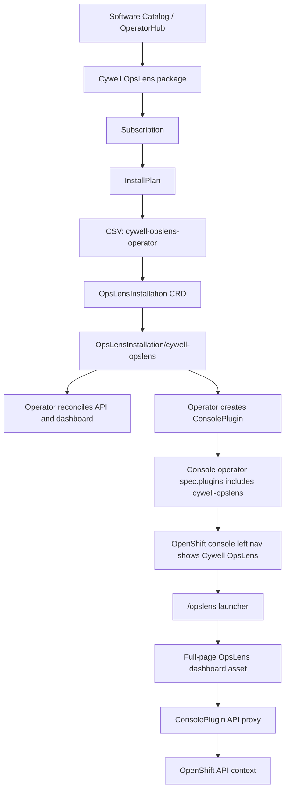

# Cywell OpsLens KOMSCO Edition Demo Brief

| Field | Value |
| --- | --- |
| Purpose | 2026-06-19 demo/presentation preparation |
| Product lane | OpenShift Console mod delivered through OperatorHub/Software Catalog |
| Current version proof | Dev 0.1.4 live CRC launch proof plus Dev 0.1.5 UI/package/demo evidence |
| Reference cluster | CRC OpenShift 4.21.14 on MacBook |
| Current branch | `feat/OpsLens-Dev0.1.5` |
| Current proof source | `npm run overnight:checkpoint` and `test-results/cywell-opslens-dev012-overnight-checkpoint.json` |

## One Sentence

Cywell OpsLens KOMSCO Edition is an OpenShift Console-installed operations assistant that uses the official OperatorHub, OLM, and ConsolePlugin extension path to add a full-page OpsLens entry to the OpenShift web console, then layers KOMSCO branding, read-only operational context, and an AI assistant on top of the standard console workflow.

## What We Are Demonstrating

The demo is not "a separate random web app next to OpenShift." The intended product story is:

```text
OpenShift web console
-> Software Catalog / OperatorHub
-> Install Cywell OpsLens Operator
-> Operator creates API, dashboard, and ConsolePlugin resources
-> ConsolePlugin is enabled in the OpenShift Console operator config
-> OpenShift left navigation shows Cywell OpsLens
-> User opens full-page Cywell OpsLens from the console
-> OpsLens reads OpenShift context through the console/plugin API path
-> KOMSCO AI Assistant guides the operator without mutating the cluster by default
```

## Official Scope We Are Using

| Official OpenShift capability | What the official documentation supports | How Cywell OpsLens uses it |
| --- | --- | --- |
| Web console as the cluster GUI | Red Hat describes the web console as the graphical interface for administrative, management, and troubleshooting work, managed by the console operator. | OpsLens is positioned as a console-native operations surface, not as an unrelated external portal. |
| Software Catalog / OperatorHub | Red Hat Operator documentation covers installing and managing Operators, including OperatorHub/software catalog flows. | Cywell OpsLens is packaged as an Operator bundle and surfaced through a CRC CatalogSource and PackageManifest. |
| Operator Lifecycle Manager | OLM installs and manages Operators through Subscription, InstallPlan, CSV, and CRD resources. | The demo installs `cywell-opslens-operator`, creates the `OpsLensInstallation` CRD, and lets the Operator reconcile API/dashboard/plugin resources. |
| Dynamic ConsolePlugin | Red Hat web console documentation says dynamic plugins can add custom pages and other console UI extensions at runtime, and that plugins are registered by `ConsolePlugin`. | OpsLens uses `ConsolePlugin/cywell-opslens` instead of DOM injection, iframe hacks, or replacing the console container. |
| Console navigation extension | OpenShift console dynamic plugin extension docs include navigation links and routes for plugin pages. | OpsLens contributes a `Cywell OpsLens` left-navigation entry and a `/opslens` route launcher. |
| Console customization limits | Red Hat customization docs cover logo, product name, links, notifications, downloads, and supported console settings. | We do not claim full arbitrary skinning of the original console chrome unless supported by official console customization or plugin APIs. |

## Official References

- Red Hat OpenShift 4.21 Web Console overview: https://docs.redhat.com/en/documentation/openshift_container_platform/4.21/html/web_console/web-console-overview
- Red Hat OpenShift 4.21 Web Console customization: https://docs.redhat.com/en/documentation/openshift_container_platform/4.21/html/web_console/customizing-web-console
- Red Hat OpenShift 4.21 Web Console dynamic plugins: https://docs.redhat.com/en/documentation/openshift_container_platform/4.21/html-single/web_console/index
- Red Hat OpenShift 4.21 Operators guide: https://docs.redhat.com/en/documentation/openshift_container_platform/4.21/html/operators/index
- Red Hat OpenShift dynamic console plugin walkthrough: https://www.redhat.com/en/blog/developing-an-openshift-dynamic-console-plugin-1
- OpenShift console dynamic plugin SDK reference: https://github.com/openshift/console/blob/main/frontend/packages/console-dynamic-plugin-sdk/README.md

## Current Implementation Flow



## What Is Already Proven

| Area | Proven result | Evidence |
| --- | --- | --- |
| CRC baseline | CRC OpenShift 4.21.14 was used as the live reference target. | `oc get clusterversion`, `oc get co` during install work. |
| Registry path | Images can be loaded on MacBook Docker and pushed to CRC internal registry. | API/dashboard/operator/catalog images reached ImageStreams. |
| OperatorHub packaging | `CatalogSource/cywell-opslens-catalog` can run and publish a package. | PackageManifest `cywell-opslens` appeared and current CSV advanced through versions. |
| Architecture compatibility | Mac CRC node is arm64, so arm64 images are required. | Earlier amd64 mismatch was fixed with arm64 image tar builds. |
| Operator install | `cywell-opslens-operator.v0.1.4` reached Succeeded in the approved CRC lane. | 0.1.4 ledger and live install output. |
| Custom resource | `OpsLensInstallation/cywell-opslens` exists and reports Ready. | Current CR status reached `Ready`, version `0.1.4` and later 0.1.3/0.1.4 lanes proved reconcile behavior. |
| API and dashboard | API and dashboard pods reached 1/1 Running. | Live CRC pod/deployment output. |
| ConsolePlugin | `ConsolePlugin/cywell-opslens` exists and points to dashboard service plus API proxy. | Live ConsolePlugin YAML and console logs. |
| Plugin enablement | Console operator `spec.plugins` included `cywell-opslens` while preserving existing plugins. | Live `oc get console.operator.openshift.io cluster` evidence. |
| Console entry | OpenShift console showed a `Cywell OpsLens` left navigation entry. | Browser evidence from 0.1.4. |
| Full-page app launch | Clicking the entry loaded the OpsLens dashboard asset through the console plugin path. | Browser DOM showed `KOMSCO`, `Cywell OpsLens`, `KOMSCO AI 어시스턴트`, no React error. |
| API connected state | Dashboard reached real API connected state rather than local fallback. | Browser showed `API 연결됨`; fallback badge disappeared. |

## What Was Fixed Along The Way

| Problem | Root cause | Fix/lesson |
| --- | --- | --- |
| Docker push failed repeatedly | Mac Docker credential helper/keychain and CRC router CA trust issues. | Use generated Docker config, trust CRC router CA, restart Docker Desktop when cert trust changes. |
| Catalog pod could not pull image | `openshift-marketplace` service accounts lacked pull permission from project image stream. | Grant image pull permission for the marketplace namespace in CRC. |
| Package appeared in CLI but not UI | Stale catalog/cache plus wrong architecture and metadata gaps. | Rebuild arm64 catalog, refresh CatalogSource pod, verify PackageManifest fields. |
| Operator installed stale version | Mutable `verify` tag and stale Subscription/InstallPlan/CSV state. | Use unique versioned CRC tags such as `v0.1.x-crc-<sha>` and clean stale install resources before reinstall. |
| Operator image pointed to external/stale image | Bundle CSV related images and deployment image did not match local CRC image stream. | Bundle must contain the exact internal registry image references for CRC demo builds. |
| `OpsLensInstallation` reconciled wrong namespace copy | A stale CR existed in `openshift-operators`. | Delete wrong namespace CR and keep the product CR in `cywell-opslens`. |
| OwnerReference RBAC errors | Operator attempted to set owner refs on resources it could not delete/finalize. | Add the required dev RBAC and tighten product RBAC contract. |
| StatefulSet immutable field errors | Existing vector StatefulSet could not be mutated across provider/storage shape changes. | CRC lightweight profile avoids pgvector/vLLM for the demo lane; production persistence remains separate. |
| Dashboard showed API fallback | API did not auto-discover in-cluster Kubernetes API and browser proxy calls missed CSRF handling. | Add in-cluster serviceaccount token/CA discovery and console CSRF header handling. |
| Bad console route experiments | Mixed iframe, direct route, plugin asset, and dashboard route models. | Lock the official pattern: console navigation href plus launcher/full-page dashboard, no iframe. |

## Version Timeline

| Version lane | Main objective | What became true | What remained |
| --- | --- | --- | --- |
| Dev 0.1.1 | Prove CRC OperatorHub install path | Local CatalogSource, PackageManifest, Operator install, CRD, and initial `OpsLensInstallation` flow were proven. | vLLM/pgvector were too heavy or not clean for CRC; stale tag and arm64 lessons were not yet fully locked. |
| Dev 0.1.2 | Recover customer-facing UI | KOMSCO branding, Korean UI direction, assistant naming, catalog icon, and reduced debug wording started. | Internal work queues and diagnostics still leaked into the UI. |
| Dev 0.1.3 | Lock official ConsolePlugin direction | Fake mode toggle was removed; official left-nav-plus-route direction was documented; verifiers began blocking unsupported UI patterns. | Live CRC install proof and route behavior were not yet clean enough. |
| Dev 0.1.4 | Make OpenShift Console launch OpsLens | OpenShift left nav showed `Cywell OpsLens`; full-page OpsLens loaded through ConsolePlugin asset path; API showed `API 연결됨`. | Assistant and left navigation polish remained; production model/vector runtime remained outside CRC scope. |
| Dev 0.1.5 | Make it feel like a usable console mod | Collapsible nav, one active page, visual operations dashboard, and chat-first movable KOMSCO AI Assistant were implemented and locally verified. | Live CRC upgrade proof remains approval-gated. |

## Evidence Map

| Claim for presentation | Evidence source in repo |
| --- | --- |
| CRC install was proven | `docs/product-goals/cywell-opslens-console-mod/versions/dev-0.1.1-crc-install.md` |
| UI recovery and KOMSCO branding work happened | `docs/product-goals/cywell-opslens-console-mod/versions/dev-0.1.2-ui-recovery.md` |
| Official ConsolePlugin product direction was locked | `docs/product-goals/cywell-opslens-console-mod/versions/dev-0.1.3-console-mod.md` |
| 0.1.4 live console launch and API connection were proven | `docs/product-goals/cywell-opslens-console-mod/versions/dev-0.1.4-console-launcher.md` |
| 0.1.5 assistant/nav/dashboard polish is implemented | `apps/web/src/App.tsx`, `apps/web/src/components/AssistantPopover.tsx`, `apps/web/src/components/OperationsDashboard.tsx`, and `docs/product-goals/cywell-opslens-console-mod/presentation/assets/dev015-opslens-*.png` |

## Current Realized Product Scope

Pass means the feature has been implemented and verified at least locally or on CRC. Partial means it is implemented but still needs stronger demo/prod proof.

| Product capability | Status | Notes |
| --- | --- | --- |
| Installable from local Software Catalog | Pass | CRC CatalogSource and PackageManifest proof exists. |
| Operator-managed install | Pass | CSV succeeded and Operator reconciles product resources. |
| ConsolePlugin registration | Pass | `ConsolePlugin/cywell-opslens` created. |
| ConsolePlugin enablement | Pass | `cywell-opslens` added to console operator plugins without removing existing plugins. |
| Left navigation entry in OpenShift Console | Pass | Entry appeared in live console. Current work must preserve this and remove malformed route experiments. |
| Full-page OpsLens entry from OpenShift Console | Pass for 0.1.4 proof | 0.1.4 loaded the dashboard through plugin asset path. |
| KOMSCO branding | Pass | Header/app/assistant branding exists and is captured in Dev 0.1.5 evidence. |
| In-cluster API connection | Pass | API connected state reached via serviceaccount token/CA and console proxy CSRF handling. |
| Read-only/plan-only posture | Pass for demo | Product docs and UI state emphasize this; production mutation workflows remain approval-gated. |
| OCP feature parity mapping | Partial | Mapping contract exists, but menu-by-menu functional parity must be completed and verified. |
| KOMSCO AI Assistant chat UX | Pass for demo | Chat-first panel, context chips, answer bubble, Enter/Shift+Enter behavior, connected/fallback state, and movable mode are implemented. |
| Production model runtime | Not in CRC demo | CRC lightweight mode uses `mock-local`; vLLM/GPU runtime remains future integration. |
| Production vector store | Not in CRC demo | CRC lightweight mode uses `inmemory`; pgvector production path needs OpenShift-safe security/storage work. |

## Current Demo Scope

The demo should show:

1. OpenShift console baseline.
2. Software Catalog / OperatorHub has Cywell OpsLens.
3. Installed Operator shows `Succeeded`.
4. `OpsLensInstallation` shows `Ready`.
5. OpenShift Console has the `Cywell OpsLens` entry.
6. Clicking the entry opens a full-page OpsLens dashboard.
7. Dashboard shows KOMSCO/Cywell OpsLens branding.
8. Dashboard shows API connected state.
9. KOMSCO AI Assistant is visible as the guidance layer.
10. Explain that CRC demo uses lightweight local runtime for safety and repeatability.

## 화면 캡처 증거

| Evidence | File |
| --- | --- |
| Software Catalog card | `docs/product-goals/cywell-opslens-console-mod/presentation/assets/catalog-cywell-opslens-card.png` |
| Software Catalog detail modal | `docs/product-goals/cywell-opslens-console-mod/presentation/assets/catalog-cywell-opslens-detail.png` |
| Dev 0.1.5 visual operations dashboard | `docs/product-goals/cywell-opslens-console-mod/presentation/assets/dev015-opslens-dashboard-desktop.png` |
| Dev 0.1.5 movable KOMSCO AI Assistant | `docs/product-goals/cywell-opslens-console-mod/presentation/assets/dev015-opslens-assistant-movable.png` |
| Dev 0.1.5 mobile responsive dashboard | `docs/product-goals/cywell-opslens-console-mod/presentation/assets/dev015-opslens-mobile-nav.png` |

Regenerate the Dev 0.1.5 UI screenshots with:

```bash
npm run -w @kugnus/web build
npm run evidence:dev015:screens
```

## Testing Scope For The Next Pass

| Test target | Why it matters | Pass evidence needed |
| --- | --- | --- |
| Console entry path | This is the product entry story. | Browser opens OpenShift console, click `Cywell OpsLens`, full-page app loads without React error. |
| Left nav behavior | The app must not look like all screens dumped into one page. | Clicking each OpsLens nav item shows only that screen; collapse/reopen works. |
| Assistant usability | It must feel like an assistant, not a debug panel. | Chat-first panel, Enter sends, Shift+Enter newline, visible connected/fallback state. |
| Assistant movement | It must not permanently block console content. | Unlock/move button works; position persists in session or resets predictably. |
| API proxy | The app must use console/plugin route, not fake local data. | Browser shows `API 연결됨`; network calls go through plugin API proxy path. |
| Official-boundary verifier | Prevent regression into iframe/DOM injection/fake toggle. | `npm run verify:console-plugin` blocks iframe, malformed nav label, unsupported route shape. |
| Version freshness | Prevent stale CSV/image recurrence. | PackageManifest currentCSV and relatedImages show the intended version/tag before install. |

## Slide Outline

### Slide 1. Title

Cywell OpsLens KOMSCO Edition: OpenShift Console-native AI operations assistant.

### Slide 2. Problem

OpenShift has strong operations surfaces, but real incident work still jumps across console pages, logs, alerts, docs, and approval boundaries. Operators need guided context without unsafe automatic mutation.

### Slide 3. Official Extension Strategy

Use OpenShift-supported extension points:

- OperatorHub / Software Catalog for installation.
- OLM for lifecycle.
- ConsolePlugin for console UI entry.
- Console proxy for API access.
- No iframe, no DOM injection, no unsupported console takeover.

### Slide 4. Product Flow

Show the install-to-launch flow:

```text
Software Catalog -> Operator -> OpsLensInstallation -> ConsolePlugin -> Cywell OpsLens left nav -> full-page OpsLens
```

### Slide 5. What Works Today

- Catalog package visible.
- Operator installs.
- CRD and CR exist.
- API/dashboard run.
- ConsolePlugin enabled.
- Console left nav entry works in the 0.1.4 proof.
- Dashboard reports connected API state.

### Slide 6. What We Learned

Most failures were not random:

- stale catalog/tag state,
- wrong architecture,
- missing registry pull permissions,
- wrong ConsolePlugin route model,
- missing in-cluster API config,
- missing browser CSRF handling.

Each has a fixed rule in the current packaging/verifier path.

### Slide 7. Current Boundary

CRC demo is intentionally lightweight:

- API/dashboard live.
- ConsolePlugin live.
- Assistant guidance live.
- Model runtime is mocked/local for demo.
- Vector store is in-memory for demo.
- No production secret or company OCP mutation.

### Slide 8. Dev 0.1.5 Demo Improvements

- Left nav collapse/reopen.
- One selected page at a time.
- Visual operations dashboard instead of plain text dumps.
- More chatbot-like KOMSCO AI Assistant.
- Movable assistant panel.
- Official ConsolePlugin path remains the product route.

### Slide 9. Demo Script

1. Open OpenShift Console.
2. Show Software Catalog / installed Operator.
3. Show `OpsLensInstallation` ready.
4. Show left navigation `Cywell OpsLens`.
5. Click it.
6. Show KOMSCO-branded dashboard.
7. Show `API 연결됨`.
8. Open KOMSCO AI Assistant.
9. Ask a safe operations question.
10. Close with official support boundary and next production hardening items.

### Slide 10. Ask

Confirm the target product direction:

- Console-native entry is correct.
- Independent full-page OpsLens app is correct.
- Assistant stays read-only/plan-only unless explicitly approved.
- Production RAG/model/vector runtime is a separate hardening phase.

## Presenter Notes

Use this wording:

> Cywell OpsLens is not replacing OpenShift Console by force. It is delivered through the official Operator and ConsolePlugin path. The console remains the trusted entry point, and OpsLens becomes a full-page operations cockpit launched from inside the console.

Avoid this wording:

> We hacked the console.
> We overwrite OpenShift.
> The local port-forward page is the product.
> The assistant can automatically fix the cluster.

## Remaining Gaps To Be Honest About

- The demo environment is CRC, not a production cluster.
- The company OCP cluster has not been mutated.
- Production-grade model runtime and vector storage are not part of the lightweight CRC demo.
- Full OpenShift console feature parity is still a product mapping and hardening task, not a claim of complete native-console replacement.
- Live CRC upgrade/application of Dev 0.1.5 remains approval-gated; local package, UI, presentation, and verifier evidence are ready.

## Decision Locked For Tomorrow

The demo should emphasize this product contract:

```text
Official OpenShift installation and console entry:
YES

Independent full-page OpsLens launched from OpenShift Console:
YES

Unsupported DOM injection / iframe / fake mode toggle:
NO

Read-only and plan-first assistant:
YES

Production autonomous mutation:
NO
```
