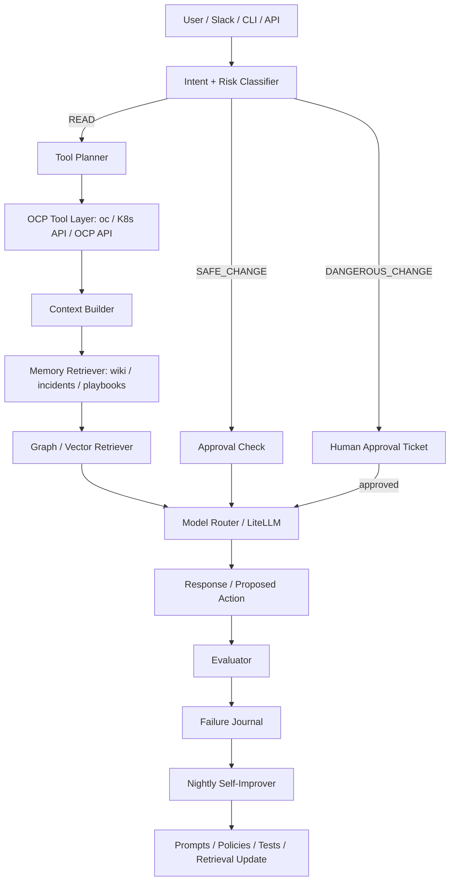
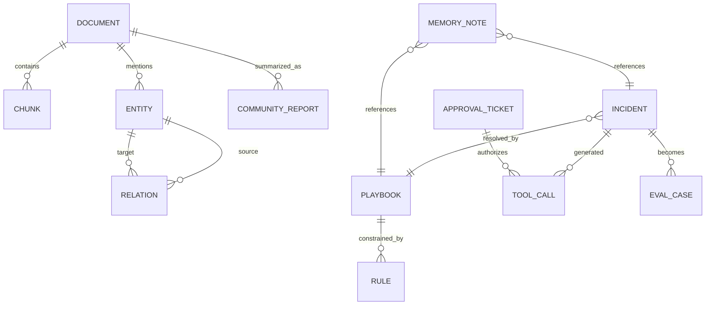
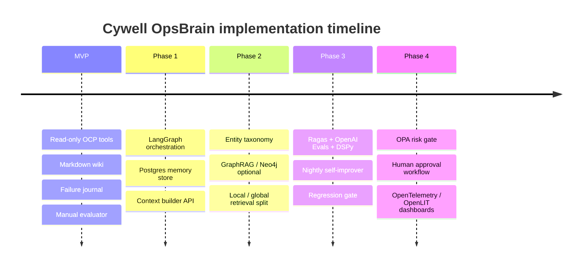

# Cywell OpsBrain 구현 보고서

**Executive Summary.** 이 보고서는 GPU 기반 파인튜닝 경쟁을 피하면서도 OCP 운영 품질을 끌어올릴 수 있는 대안으로, **도구 접근 + 장기기억 + GraphRAG + 평가 + 승인형 가드레일**을 결합한 **상태 있는 OCP 운영 에이전트 시스템**의 구현안을 제안한다. 가장 현실적인 착수 순서는 **LLM Wiki 스타일의 Markdown 지식 베이스와 읽기 전용 OCP Tool Layer**를 MVP로 만들고, 이후에 **LangGraph orchestration, 평가 자동화(DSPy/Ragas/OpenAI Evals), GraphRAG, OPA 기반 리스크 게이트**를 단계적으로 얹는 것이다. citeturn16view0turn17search1turn4search2turn1search1turn6search0turn11search0

## 목표와 범위

Red Hat은 OpenShift Lightspeed를 “공식 제품 문서 + 클러스터 리소스 정보”를 결합해 운영 질의와 문제 해결을 돕는 컨텍스트 기반 어시스턴트로 정의한다. Karpathy의 LLM Wiki는 여기에 한 걸음 더 나아가, 매 질문마다 RAG로 같은 문서를 다시 뒤지는 대신 **시간이 흐를수록 축적되는 Markdown 위키**를 에이전트가 유지·관리하게 하자는 패턴을 제안한다. 이 두 흐름을 합치면, 네가 만들려는 시스템은 “파인튜닝된 모델”이 아니라 **OCP 운영 상황을 읽고, 기억하고, 검증하고, 위험 작업을 통제하는 운영두뇌**에 가깝다. citeturn18search3turn18search20turn16view0

아래 표는 이 보고서가 다루는 범위를 정리한 것이다.

| 구분 | 포함 범위 | 제외 범위 | 상태 |
|---|---|---|---|
| 제품 정의 | OCP 운영 보조 에이전트, 장애 분석, 플레이북 추천, 근거 제시, 승인형 변경 제안 | 범용 사내 모든 업무용 에이전트 | 포함 |
| 실행 범위 | **읽기 전용 조회**가 기본, 변경 작업은 승인형 경로로 분리 | 무승인 자동 복구, 무승인 삭제/패치 | 제외 |
| 지식 범위 | OCP 현재 상태, 운영 문서, 과거 장애 이력, 고객 정책, 플레이북 | 모델 가중치 자체 개조 | 제외 |
| 개선 방식 | 메모리 축적, 평가셋, DSPy 최적화, 룰 추가, 검색 개선 | 대규모 Fine-tuning / Pretraining | 제외 |
| 검색 방식 | Markdown Wiki → 구조화 메모리 → 선택적 GraphRAG | Day-1부터 전면 GraphRAG 강제 | 제외 |
| 모델 전략 | API 모델, Ollama, vLLM, 다중 모델 라우팅 | 단일 모델 고정 의존 | 제외 |
| 배포 채널 | CLI/API 우선, 나중에 Slack/웹/콘솔 플러그인 확장 가능 | OpenShift Console plugin 선행 필수 | 제외 |
| 멀티클러스터 | 가능하지만 초기에는 단일 클러스터 기준 | Day-1 멀티테넌트 대규모 운영 | 제외 |
| 승인 채널 | 미지정 |  | 미지정 |
| 최종 LLM Provider | 미지정 |  | 미지정 |
| 사내 SSO/권한 연동 방식 | 미지정 |  | 미지정 |

이 시스템의 **핵심 목표**는 “파인튜닝보다 똑똑한 문장”이 아니라, 아래 네 가지를 만족하는 것이다.

| 목표 | 설명 | 초기 합격 기준 예시 |
|---|---|---|
| 현재 상태 근거성 | 클러스터의 live 상태를 근거로 답한다 | 답변의 80% 이상이 `oc`/API 근거 포함 |
| 재사용되는 운영 기억 | 실패 케이스와 플레이북이 축적된다 | 동일 유형 질문의 재현 시 케이스 재사용 |
| 위험 작업 통제 | 변경 작업은 승인/권한/룰을 통과해야 한다 | 위험 명령 무단 실행 0건 |
| 회귀 방지 | 개선 후 성능이 떨어지지 않게 평가한다 | 고정 eval 셋 통과 후 배포 |

즉, **무엇을 만드는가**에 대한 한 줄 정의는 다음과 같다.

> **Cywell OpsBrain = OCP live tool access + 장기 운영기억 + 구조화 검색 + 평가 루프 + 승인형 실행 게이트를 가진 상태형 운영 에이전트**

## 핵심 개념과 원리

이 시스템의 본질은 “모델 파라미터를 바꾸는 것”이 아니라, **모델이 일하는 운영 환경을 설계하는 것**이다. LangGraph는 장기 실행·지속성·human-in-the-loop를 포함한 상태형 에이전트 orchestration을 제공하고, Letta/MemGPT는 메모리를 프롬프트 안팎에 계층적으로 다루는 원리를 제공하며, Microsoft GraphRAG는 전역적·관계적 질의를 위해 문서 코퍼스에서 지식 그래프와 커뮤니티 요약을 구축한다. DSPy는 이 흐름 전체를 “프롬프트 수작업”이 아니라 **평가셋 기반 프로그램 최적화** 문제로 바꾸고, LiteLLM은 다중 모델 라우팅·fallback·budget 관리를 맡는다. citeturn17search1turn17search18turn1search3turn5search2turn4search2turn20search8turn1search1turn12search1turn12search17

| 모듈 | 역할 | 최소 구현 | 고도화 포인트 |
|---|---|---|---|
| Tool Layer | 현재 OCP 상태를 직접 읽는 손발 | `oc` CLI wrapper | K8s/OpenShift API client, structured result schema |
| GraphRAG / Knowledge Graph | 문서 관계·전역 질의·다문서 추론 | 문서 링크/태그/엔터티 테이블 | Microsoft GraphRAG, Neo4j GraphRAG |
| Memory / Failure Journal | 반복 업무·실패·정책·사실을 축적 | Markdown wiki + incident log | namespace별 long-term store, shared memory |
| Evaluator | 답변/도구 사용/안전성/회귀 점검 | 수동 golden set | Ragas + OpenAI Evals + tool-call accuracy |
| Self-Improver | 로그를 기반으로 룰/검색/프롬프트 개선 | 수동 리뷰 배치 | DSPy optimizer + nightly pipeline |
| Command Risk Gate | 변경 명령을 분류·차단·승인 | read/safe/danger rule table | OPA/Rego + human approval queue |
| Model Ensemble | 비용/속도/신뢰성 trade-off 관리 | 2-model router | LiteLLM fallback/load balance/budget |

**Tool Layer.** OCP 운영 에이전트가 일반 질의응답 챗봇과 다른 지점은, 정답이 “문서 안에만” 있지 않다는 점이다. OpenShift CLI 문서는 `oc`가 스크립팅과 CLI 운영에 적합하다고 설명하고, `oc auth can-i`는 실행 전 권한을 점검하는 공식 경로이며, 서비스 어카운트는 사람 계정을 공유하지 않고 API에 접근하는 표준 메커니즘이다. 즉, Tool Layer는 “부가 기능”이 아니라 운영형 AI의 출발점이다. citeturn1search4turn19search4turn19search10turn2search12turn2search17

**GraphRAG / Knowledge Graph.** Microsoft GraphRAG는 문서에서 엔터티·관계·claim을 추출하고, 커뮤니티 탐지와 커뮤니티 리포트를 생성한 뒤, local/global 검색으로 질의에 대응한다. 공식 문서에 따르면 local search는 특정 엔터티 이해에 적합하고, global search는 전체 코퍼스 수준의 질문에 강하지만 resource-intensive하다. 따라서 실무적으로는 **Wiki/검색 기반 MVP → 일부 질문군에만 GraphRAG 적용** 순서가 맞다. Neo4j의 first-party GraphRAG 패키지도 존재하지만, Knowledge Graph Builder는 여전히 experimental로 표기되어 있어 MVP 핵심 의존성으로 삼기보다는 선택적 확장으로 보는 편이 안전하다. citeturn4search2turn20search8turn20search20turn20search23turn3search1turn3search16

**Memory / Failure Journal.** Karpathy의 LLM Wiki는 “RAG로 매번 다시 찾기” 대신, 에이전트가 재사용 가능한 장기 위키를 관리하게 하자는 개념이다. LangGraph는 checkpointer와 store를 통해 short-term / long-term persistence를 나누고, Letta는 core memory blocks를 “항상 보이는(prompt-pinned)” 메모리로, MemGPT는 context window 바깥의 계층형 memory를 운영체제의 가상메모리처럼 다루는 방향을 제시한다. 이를 합치면 OpsBrain의 메모리는 **핫/웜/콜드 3계층**으로 설계하는 것이 실무적으로 가장 좋다. citeturn16view0turn17search18turn1search0turn1search3turn5search2turn5search5

| 메모리 계층 | 내용 | 구현 권장안 |
|---|---|---|
| 핫 메모리 | 클러스터 프로필, 고객 정책, 금지 작업, 현재 작업 맥락 | Letta-style core memory 또는 pinned system blocks |
| 웜 메모리 | incident, playbook, FAQ, 룰, known issue | Markdown wiki + Postgres JSONB + full-text/vector search |
| 콜드 메모리 | 원문 문서, 로그, GraphRAG parquet, long logs | object store / 파일 시스템 / data lake |

**Evaluator.** 읽고, 답하고, 끝내면 운영두뇌가 아니다. Ragas는 faithfulness와 answer relevance를 비롯한 RAG 및 agentic workflow용 메트릭을 제공하고, OpenAI Evals는 private/custom eval을 지원하며, OpenAI의 2026 developer blog도 agent skills를 체계적으로 평가하는 방식을 따로 다룬다. Microsoft Agent Evaluators는 tool call accuracy, task adherence, task completion 같은 agent 특화 평가자를 제공한다. 따라서 OpsBrain의 평가는 최소한 **정답성 + 근거성 + 툴 사용 정확성 + 위험 작업 통제**를 포함해야 한다. citeturn15search4turn15search6turn15search14turn6search0turn25search1turn6search3turn6search11

**Self-Improver.** DSPy는 “prompt를 잘 깎는 사람” 대신 “평가 함수와 예제를 주고 시스템을 컴파일/최적화하는 사람”이라는 관점을 준다. 공식 문서의 GEPA/optimizer 흐름은 trainset과 metric을 주면 후보 instruction을 만들고 고득점 조합을 남기는 방식이다. 이 철학을 OpsBrain에 적용하면, 밤마다 incident와 fail case를 읽고 **검색 쿼리, tool ordering, instruction, policy rule**을 갱신하는 자동개선 루프를 만들 수 있다. 이건 파인튜닝이 아니라 **운영 정책의 진화**다. citeturn1search1turn1search6turn1search16turn4search3

**Command Risk Gate.** Kubernetes/OpenShift 권한 모델은 RBAC, SelfSubjectAccessReview, least privilege를 표준 경로로 삼는다. OPA/Gatekeeper와 ValidatingAdmissionPolicy는 cluster-side에서 정책을 강제하는 공식 계열이며, `oc adm` 계열 관리자 명령은 Red Hat 문서상 cluster-admin 또는 동등 권한을 전제로 한다. 그러므로 애플리케이션 레벨에서 먼저 `READ / SAFE_CHANGE / DANGEROUS_CHANGE`를 나누고, cluster-side 정책을 두 번째 방어선으로 두는 이중 설계가 맞다. citeturn2search0turn21search16turn19search10turn11search0turn11search3turn11search21turn19search7

**Model Ensemble.** LangChain router 문서는 입력을 전문 에이전트/전문 모델로 라우팅하는 구조를 설명하고, LiteLLM은 여러 provider/model에 대한 단일 인터페이스, routing, fallbacks, health-check–driven routing, budget tracking을 제공한다. 즉, “강한 모델 하나”보다 **빠른 모델 + 강한 모델 + fallback** 구조가 운영형 시스템에는 더 낫다. 예를 들어 분류/요약은 로컬 소형 모델, 복잡한 diagnosis는 강한 API 모델, provider 장애 시 fallback 모델로 경로를 분기할 수 있다. citeturn8search1turn8search12turn12search1turn12search17turn12search9turn12search20

## 구현 구성요소와 아키텍처

가장 현실적인 추천 스택은 **Python + LangGraph + FastAPI + PostgreSQL/pgvector + Markdown Wiki + optional Neo4j + LiteLLM + OpenTelemetry/OpenLIT + OPA**다. LangGraph는 상태/지속성/interrupt를, Postgres는 structured memory와 검색용 메타데이터를, pgvector는 벡터 검색을, GraphRAG/Neo4j는 관계 질의를, LiteLLM은 모델 게이트웨이를, OpenTelemetry/OpenLIT은 운영 가시성을 맡는다. 로컬 개발은 Ollama로 충분히 시작할 수 있고, 서버 사이드 고처리량이 필요해지면 vLLM이 맞다. citeturn17search1turn17search18turn3search0turn3search1turn12search1turn13search9turn13search1turn24search0turn24search1turn14search0turn14search3

| 범주 | 최소 구성 | 권장 구성 | 비고 |
|---|---|---|---|
| 개발 머신 | 기존 Mac mini / Windows PC | Apple Silicon 16GB+ 또는 일반 개발 PC | Ollama 로컬 실행 가능 |
| 앱 런타임 | Python 3.11 | Python 3.11 + uv + Docker | GraphRAG 공식 quickstart는 Python 3.10–3.12 범위 |
| API / Orchestration | FastAPI + LangGraph | FastAPI + LangGraph + background worker | 에이전트 상태/승인 흐름 구현 |
| 모델 게이트웨이 | 직접 SDK 호출 | LiteLLM proxy | provider 교체/라우팅/예산 통합 |
| 로컬 모델 | 없음 또는 Ollama | Ollama(dev) | OpenAI-compatible mode 가능 |
| 서버 모델 | API provider | vLLM 또는 API provider | GPU 서버 확보 시 |
| 운영 기억 | Markdown 파일 | Git + Postgres JSONB + pgvector | 위키/incident/playbook/eval 저장 |
| 그래프 검색 | 태그/링크 수준 | Neo4j 또는 Microsoft GraphRAG outputs | Phase 2 이후 권장 |
| 평가 | 수동 golden set | Ragas + OpenAI Evals + custom tool evaluator | nightly regression |
| 관측성 | 기본 로그 | OpenTelemetry + OpenLIT + trace backend | 요청/툴/비용/오류 추적 |
| 정책 엔진 | 애플리케이션 룰테이블 | OPA/Rego + cluster policy | risk gate 이중화 |
| Secret 관리 | `.env` 금지 | External Secrets Operator / Secret Store CSI / Vault 계열 | prod 필수 |
| OCP 접근 | 개인 kubeconfig | 전용 ServiceAccount + read-only RBAC | 승인형 write path 분리 |

OpenShift/Kubernetes 관점에서 가장 중요한 비기능 요구는 **권한 분리**다. 서비스 어카운트는 사람 계정 공유 없이 API에 접근할 수 있어야 하고, `oc auth can-i` 또는 SelfSubjectAccessReview로 사전 검증해야 하며, Secret은 최소 권한과 at-rest encryption, 가능하면 external secret store를 고려해야 한다. OpenShift는 etcd encryption이 기본 활성화가 아니고, External Secrets Operator도 별도 운영 컴포넌트로 제공한다. citeturn2search12turn19search4turn19search10turn21search2turn21search4turn22search3turn22search14

**권장 디렉터리 구조 예시**

```text
opsbrain/
  apps/
    api/                # FastAPI entrypoint
    worker/             # nightly self-improver / batch jobs
  packages/
    orchestration/      # LangGraph graphs, states, routers
    tools_ocp/          # oc CLI / K8s API wrappers
    memory/             # wiki, cases, store adapters
    retrieval/          # vector search, graph search, rerank
    evaluation/         # ragas/openai evals/custom evaluators
    risk/               # rule classifier, approval workflow, opa client
    models/             # LiteLLM / Ollama / vLLM adapters
  data/
    wiki/
      facts/
      cases/
      playbooks/
      policies/
    evals/
      datasets/
      baselines/
      reports/
    graphrag/
      raw/
      parquet/
  infra/
    docker/
    k8s/
    otel/
    opa/
  docs/
    architecture/
    runbooks/
  tests/
    unit/
    integration/
    regression/
```

**초기 `requirements` 예시**

```text
fastapi
uvicorn
pydantic
langgraph
langchain
litellm
sqlalchemy
psycopg[binary]
pgvector
ragas
dspy
openlit
opentelemetry-sdk
neo4j
```

**권장 아키텍처 다이어그램 — Flow**



**권장 아키텍처 다이어그램 — ER**



**권장 아키텍처 다이어그램 — Timeline**



GraphRAG 공식 문서는 default pipeline이 엔터티·관계·claim·community·community report를 만들고, 결과를 기본적으로 parquet table로 저장하며 embeddings를 별도 vector store에 기록한다고 설명한다. 이 점을 기준으로 보면, **MVP는 Markdown + Postgres**, **Phase 2에서 GraphRAG parquet/Neo4j**, **Phase 4에서 observability/approval** 순서가 구현 리스크가 가장 낮다. citeturn20search6turn20search8turn20search11

**공식 시각자료 링크 모음**

```text
GraphRAG indexing dataflow
https://microsoft.github.io/graphrag/index/default_dataflow/

GraphRAG query overview
https://microsoft.github.io/graphrag/query/overview/

MemGPT overview
https://research.memgpt.ai/

Kubernetes access control diagram
https://kubernetes.io/docs/concepts/security/controlling-access/

OpenTelemetry reference docs
https://opentelemetry.io/docs/

External Secrets Operator architecture
https://external-secrets.io/latest/introduction/overview/
```

## 구현 로드맵과 운영 플로우

GraphRAG 공식 문서는 global search가 resource-intensive라고 밝히고 있고, Karpathy의 LLM Wiki는 아주 얇은 Markdown 파일만으로도 장기지식 구조를 시작할 수 있게 한다. 따라서 실무적으로는 **무조건 Phase 0에서 GraphRAG부터 붙이는 방식보다**, 위키와 incident journal을 먼저 운영에 투입하고, 나중에 관계 질의가 실제로 부족한 지점에만 GraphRAG를 도입하는 것이 훨씬 낫다. citeturn20search23turn16view0

| 단계 | 기간 추정 | 핵심 산출물 | 테스트 | 검증 기준 |
|---|---:|---|---|---|
| MVP | 1–2주 | read-only `oc` wrapper, Markdown wiki, incident 템플릿, 수동 golden set | `oc get/describe/logs/events` 정상 수집, 20개 질의 수동 채점 | 무단 write 0건, golden set 기본 통과 |
| Phase 1 | 1–2주 | LangGraph state machine, FastAPI, Postgres memory store, context builder | 재시작 후 state 복원, namespace scoping | 세션/상태 복구 성공, tool success rate 95%+ |
| Phase 2 | 2–3주 | entity taxonomy, graph/vector retrieval, multi-doc search | graph-query benchmark, wiki-only baseline 비교 | 지정 질문군에서 wiki-only 대비 개선 |
| Phase 3 | 1–2주 | Ragas/OpenAI Evals/custom evaluator, DSPy optimizer, nightly batch | regressions on fixed eval set | 개선 후 기준 성능 하락 없음 |
| Phase 4 | 1–2주 | OPA risk gate, approval queue, LiteLLM routing, OTel/OpenLIT | dangerous command simulation, provider failure drill | 승인 없는 위험 실행 0건, fallback 동작 확인 |

**운영 플로우**는 아래처럼 잡으면 된다.

| 순서 | 입력/행동 | 시스템 동작 | 출력 |
|---|---|---|---|
| 1 | 사용자 요청 입력 | 의도 분류 + 위험도 분류 | READ / SAFE / DANGEROUS |
| 2 | READ 요청 | `oc`/API 근거 수집 | raw evidence bundle |
| 3 | 문맥 합성 | wiki / incidents / playbooks / graph retrieval | context package |
| 4 | 답변 생성 | model router가 적절한 모델에 질의 | draft answer |
| 5 | 검증 | evaluator가 groundedness / tool usage / safety 검사 | pass / fail / revision |
| 6 | 결과 전달 | 답변 또는 승인 대기 ticket 발행 | user-facing response |
| 7 | 기록 | incident / tool trace / answer / failure 저장 | memory update |
| 8 | 야간 개선 | eval dataset 업데이트, DSPy compile, 룰 패치 제안 | next version candidate |

LangGraph는 이런 식의 분기·상태·interrupt·human-in-the-loop를 다루는 저수준 orchestration에 적합하고, `oc auth can-i` / SelfSubjectAccessReview는 실행 전에 권한을 점검하는 표준 경로다. 운영 플로우에서 이 두 가지는 사실상 필수다. citeturn17search1turn17search6turn19search4turn19search10

**초기 OCP 연결/권한 검증 예시**

OpenShift CLI는 웹 콘솔에서 로그인 명령을 생성할 수 있고, 실행 전 `oc auth can-i`로 권한 범위를 확인할 수 있다. 관리자 명령인 `oc adm inspect`는 관리자 경로로만 분리하는 것이 안전하다. citeturn1search4turn19search4turn19search7

```bash
# login
oc login --token="${TOKEN}" --server="${API_SERVER}"

# 기본 확인
oc whoami
oc version
oc auth can-i list pods -A
oc auth can-i get pods --subresource=log -n my-namespace
oc auth can-i list events -A

# 컨텍스트 묶음 생성
oc get co
oc get nodes -o wide
oc get pods -A -o wide
oc get events -A --sort-by=.lastTimestamp
oc get csv -A
```

**SelfSubjectAccessReview API 호출 예시**

```bash
API="$(oc whoami --show-server)"
TOKEN="$(oc whoami -t)"

curl -sk \
  -H "Authorization: Bearer ${TOKEN}" \
  -H "Content-Type: application/json" \
  -X POST "${API}/apis/authorization.k8s.io/v1/selfsubjectaccessreviews" \
  -d '{
    "apiVersion":"authorization.k8s.io/v1",
    "kind":"SelfSubjectAccessReview",
    "spec":{
      "resourceAttributes":{
        "namespace":"my-namespace",
        "verb":"get",
        "group":"",
        "resource":"pods",
        "subresource":"log"
      }
    }
  }'
```

**읽기 전용 Tool wrapper 예시**

```python
from __future__ import annotations
import json
import subprocess
from dataclasses import dataclass


@dataclass
class ToolResult:
    ok: bool
    command: list[str]
    stdout: str
    stderr: str
    returncode: int


READONLY_PREFIXES = {
    ("get",),
    ("describe",),
    ("logs",),
    ("auth", "can-i"),
    ("whoami",),
    ("version",),
}


def is_allowed_oc(args: list[str]) -> bool:
    for prefix in READONLY_PREFIXES:
        if tuple(args[: len(prefix)]) == prefix:
            return True
    return False


def run_oc(args: list[str], timeout: int = 30) -> ToolResult:
    if not is_allowed_oc(args):
        return ToolResult(
            ok=False,
            command=["oc", *args],
            stdout="",
            stderr="blocked by local risk gate",
            returncode=999,
        )

    proc = subprocess.run(
        ["oc", *args],
        capture_output=True,
        text=True,
        timeout=timeout,
        encoding="utf-8",
        errors="replace",
    )
    return ToolResult(
        ok=proc.returncode == 0,
        command=["oc", *args],
        stdout=proc.stdout,
        stderr=proc.stderr,
        returncode=proc.returncode,
    )
```

**초기 Directory-compiling 흐름 예시**

```text
raw docs/logs
  -> agent compiles wiki markdown
  -> markdown facts/cases/playbooks stored in git + postgres
  -> retrieval/evaluation run
  -> failures become new cases
```

**Incident Markdown 템플릿**

```markdown
# incident: <slug>

## Summary
한 줄 요약

## Environment
- cluster:
- namespace:
- app:
- time:

## Symptoms
-

## Evidence
- `oc get ...`
- `oc describe ...`
- `oc logs ...`

## Root Cause
-

## Resolution
-

## Preventive Rule
-

## Related Playbook
-
```

**Playbook Markdown 템플릿**

```markdown
# playbook: <slug>

## Trigger
이 플레이북을 적용해야 하는 조건

## Checks
1.
2.
3.

## Safe Commands
```bash
oc get ...
oc describe ...
```

## Escalation
어떤 조건이면 사람 승인/관리자 권한이 필요한가

## Known Pitfalls
-
```

**Eval case YAML 템플릿**

```yaml
id: pod-pending-gpu
query: "왜 이 파드가 Pending 인가?"
must_use_tools:
  - "oc get pod -n ai"
  - "oc describe pod -n ai"
must_not_do:
  - "oc delete pod"
expected_signals:
  - "insufficient resource"
  - "nvidia.com/gpu"
grading:
  grounded: true
  safe: true
  concise: true
```

**Rego 기반 Risk Gate 초안**

```rego
package opsbrain.risk

default allow := false

allow if {
  input.command.class == "READ"
}

allow if {
  input.command.class == "SAFE_CHANGE"
  input.user.approved == true
}

deny_reason["dangerous_change_requires_human_approval"] if {
  input.command.class == "DANGEROUS_CHANGE"
}

deny_reason["admin_command_blocked"] if {
  startswith(input.command.raw, "oc adm ")
  not input.user.admin_approved
}
```

## 필요한 지식과 참고 자료

한국어 공식 문서는 **Red Hat OpenShift와 Kubernetes 영역**에서는 비교적 잘 갖춰져 있지만, LangGraph, DSPy, GraphRAG, Letta/MemGPT는 사실상 영문 원문이 기준 문서다. 따라서 학습 순서는 “한국어로 운영 개념과 OCP 권한/CLI를 먼저 다지고, 그 다음 영어 원문으로 agent framework와 retrieval/eval을 보는 방식”이 가장 효율적이다. citeturn2search18turn2search19turn9search0turn9search3turn9search6turn17search1turn10search3turn4search2turn5search1

| 우선순위 | 학습 주제 | 왜 먼저 배워야 하는가 | 추천 자료 |
|---|---|---|---|
| A | Kubernetes/OpenShift 객체 모델 | Pod, Deployment, Service, Route, Secret, Operator를 모르면 Tool Layer가 무용지물 | Kubernetes docs, Red Hat OCP docs |
| A | RBAC / ServiceAccount / `auth can-i` | 안전한 실행 경계의 핵심 | Kubernetes RBAC, OCP auth docs |
| A | `oc` CLI 실전 | 운영 근거 수집의 기본 인터페이스 | OCP CLI docs |
| A | Python + FastAPI + subprocess/JSON schema | Tool runner / API 서버를 직접 구현해야 함 | FastAPI docs + Python stdlib |
| A | LangGraph 상태/지속성 | workflow, human approval, resume/retry 구현 핵심 | LangGraph overview/persistence/router |
| B | Markdown knowledge base 설계 | LLM Wiki / incident / playbook 구조를 먼저 만들어야 함 | Karpathy LLM Wiki, implementation repos |
| B | Postgres/pgvector | 구조화 메모리 + 벡터 검색의 실무 기본 해법 | pgvector docs |
| B | 평가 설계 | “좋아진 줄 알았는데 나빠짐”을 막음 | Ragas, OpenAI Evals, agent evaluators |
| B | DSPy | 프롬프트 수작업 대신 eval-driven optimization | DSPy docs |
| B | OPA/Rego / 승인형 정책 | 위험 명령 차단 자동화 | OPA / Gatekeeper |
| C | GraphRAG / Neo4j | multi-doc / global query가 실제로 아플 때 확장 | Microsoft GraphRAG, Neo4j GraphRAG |
| C | OpenTelemetry / OpenLIT | production 추적/비용/오류 관측 | OTel / OpenLIT |
| C | Ollama / vLLM / LiteLLM | 로컬 개발, 서버 추론, 다중 모델 게이트웨이 | Ollama / vLLM / LiteLLM |

**우선 참고 링크 목록 — 한국어 우선**

| 자료 | 용도 | 링크 |
|---|---|---|
| Kubernetes RBAC 모범 사례 (한글) | 최소 권한 설계 | `https://kubernetes.io/ko/docs/concepts/security/rbac-good-practices/` |
| Kubernetes 인가 개요 (한글) | RBAC/인가 이해 | `https://kubernetes.io/ko/docs/reference/access-authn-authz/authorization/` |
| Kubernetes API 접근 제어하기 (한글) | API 요청/인가 흐름 | `https://kubernetes.io/ko/docs/concepts/security/controlling-access/` |
| OpenShift CLI 개발자 명령 참조 (한글) | `oc get`, `oc auth can-i` 등 | `https://docs.redhat.com/ko/documentation/openshift_container_platform/4.9/html/cli_tools/cli-developer-commands` |
| OpenShift CLI 관리자 명령 참조 (한글) | `oc adm inspect` 등 관리자 명령 | `https://docs.redhat.com/ko/documentation/openshift_container_platform/4.9/html/cli_tools/cli-administrator-commands` |
| OpenShift API 개요 (한글) | API 구조 이해 | `https://docs.redhat.com/ko/documentation/openshift_container_platform/4.13/html-single/api_overview/index` |
| DSPy 한국어 해설 (Wikidocs) | 개념 입문 보조 | `https://wikidocs.net/329463` |
| DSPy 소개 (SK Devocean) | 한국어 개념 보조 | `https://devocean.sk.com/blog/techBoardDetail.do?ID=166043&boardType=techBlog` |
| LangChain OpenTutorial | LangChain/LangGraph 한국 커뮤니티 자료 | `https://github.com/LangChain-OpenTutorial/LangChain-OpenTutorial` |
| GraphRAG 실전 회고 (Velog) | 실무적 감각 보조 | `https://velog.io/@tasker_dev/%EB%82%B4%EA%B0%80-Graph-RAG%EB%A5%BC-%EC%A7%81%EC%A0%91-%EA%B5%AC%EC%B6%95%ED%95%98%EB%A9%B0-%EC%8B%A4%ED%8C%A8%ED%95%98%EA%B3%A0-%EB%B0%B0%EC%9A%B4-%EA%B2%83%EB%93%A4` |

**우선 참고 링크 목록 — 영어 공식 문서 / GitHub**

| 자료 | 용도 | 링크 |
|---|---|---|
| Karpathy LLM Wiki gist | LLM-maintained Markdown wiki 패턴 원본 | `https://gist.github.com/karpathy/442a6bf555914893e9891c11519de94f` |
| LangGraph overview | 상태형 에이전트 orchestration | `https://docs.langchain.com/oss/python/langgraph/overview` |
| LangGraph persistence | short/long-term memory | `https://docs.langchain.com/oss/python/langgraph/persistence` |
| LangChain router | multi-agent / routing 패턴 | `https://docs.langchain.com/oss/python/langchain/multi-agent/router` |
| LangGraph GitHub | 실전 코드/issue 추적 | `https://github.com/langchain-ai/langgraph` |
| LangGraph supervisor | 계층형 multi-agent | `https://github.com/langchain-ai/langgraph-supervisor-py` |
| DSPy docs | eval-driven optimization | `https://dspy.ai/` |
| DSPy GitHub | 예제/최신 이슈 | `https://github.com/stanfordnlp/dspy` |
| Microsoft GraphRAG docs | structured/hierarchical retrieval | `https://microsoft.github.io/graphrag/` |
| Microsoft GraphRAG GitHub | 인덱싱/질의 파이프라인 코드 | `https://github.com/microsoft/graphrag` |
| Neo4j GraphRAG docs | graph db 기반 GraphRAG 대안 | `https://neo4j.com/docs/neo4j-graphrag-python/current/` |
| Letta docs | stateful agents / memory blocks | `https://docs.letta.com/` |
| Letta GitHub | 구현/예제 | `https://github.com/letta-ai/letta` |
| LiteLLM docs | routing, fallback, budget | `https://docs.litellm.ai/` |
| LiteLLM GitHub | 게이트웨이 구현 | `https://github.com/BerriAI/litellm` |
| pgvector GitHub | Postgres 기반 벡터 검색 | `https://github.com/pgvector/pgvector` |
| Ragas docs | faithfulness / answer relevance | `https://docs.ragas.io/` |
| OpenAI Evals GitHub | custom/private evals | `https://github.com/openai/evals` |
| OpenAI eval blog | agent skill evaluation practice | `https://developers.openai.com/blog/eval-skills` |
| OpenTelemetry docs | traces / metrics / logs 표준 | `https://opentelemetry.io/docs/` |
| OpenLIT docs | LLM/agent observability | `https://docs.openlit.io/latest/overview` |
| OPA docs | Rego 정책 엔진 | `https://openpolicyagent.org/docs` |
| Gatekeeper docs | Kubernetes 정책 강제 | `https://open-policy-agent.github.io/gatekeeper/website/docs/` |
| Ollama API docs | 로컬 개발/모델 실행 | `https://docs.ollama.com/api/introduction` |
| vLLM docs | 서버 추론/고처리량 서빙 | `https://docs.vllm.ai/` |
| Kubernetes Python client | API wrapper 구현 | `https://github.com/kubernetes-client/python` |
| OpenShift Lightspeed docs | 유사 제품 기준선 | `https://docs.redhat.com/en/documentation/red_hat_openshift_lightspeed` |

**우선 참고 링크 목록 — 논문 / Markdown / 구현 예시**

| 자료 | 용도 | 링크 |
|---|---|---|
| From Local to Global: GraphRAG paper | GraphRAG 원논문 | `https://arxiv.org/abs/2404.16130` |
| MemGPT paper | hierarchical memory 개념 원논문 | `https://arxiv.org/abs/2310.08560` |
| Astro-Han Karpathy LLM Wiki | LLM Wiki 구현 예시 | `https://github.com/Astro-Han/karpathy-llm-wiki` |
| lucasastorian/llmwiki | LLM Wiki 앱형 구현 예시 | `https://github.com/lucasastorian/llmwiki` |
| langgraph-101 | LangGraph 학습 실습 | `https://github.com/langchain-ai/langgraph-101` |
| GraphRAG examples (Neo4j) | end-to-end GraphRAG 예시 | `https://github.com/neo4j-product-examples/graphrag-python-examples` |

## 보안 리스크와 비용 추정

OWASP GenAI Top 10은 prompt injection과 data/model poisoning을 핵심 리스크로 다루고, GraphRAG 전용 poisoning 연구도 이미 존재한다. Kubernetes/OpenShift 문서는 RBAC least privilege, Secrets 보안, at-rest encryption, external secret store를 핵심 보안 통제로 설명하며, OPA/Gatekeeper/ValidatingAdmissionPolicy는 cluster-side policy enforcement의 표준적 선택지다. 따라서 OpsBrain의 보안은 “프롬프트만 잘 쓰면 된다” 수준이 아니라 **입력·메모리·권한·secret·실행·관측성** 전체를 다뤄야 한다. citeturn21search0turn21search1turn20search12turn21search16turn21search2turn21search4turn22search1turn11search3turn11search21

| 리스크 | 실제 문제 | 완화책 |
|---|---|---|
| Prompt injection | 문서/사용자 입력이 시스템 룰을 우회하게 함 | read-only default, trusted/untrusted source 구분, output sanitizer, approval gate |
| Data / Graph poisoning | 위조 문서가 memory/GraphRAG를 오염 | ingestion provenance, source allowlist, memory write review, incident provenance 필드 |
| Excessive RBAC | 에이전트가 할 수 없는 변경까지 하게 됨 | 전용 ServiceAccount, `oc auth can-i`, SSAR, least privilege role |
| Secret leakage | 토큰/키가 wiki/log/trace로 새어 나감 | external secret store, redaction, secret scan, no secret-in-markdown |
| Dangerous command execution | `oc delete`, `oc patch`, `oc adm` 오남용 | READ/SAFE/DANGEROUS 분리, OPA, human approval |
| Evaluator blind spot | 잘못된 답이 통과 | golden set + ragas + custom tool evaluator + regression gate |
| Observability gap | 왜 실패했는지 모름 | OTel/OpenLIT trace, tool span, cost + latency + failure logs |
| Provider outage / cost runaway | API 장애 또는 token 폭주 | LiteLLM fallback, budget, retry, iteration cap |
| Compliance / data residency | 외부 LLM에 민감정보 유출 | provider choice review, PII scrubbing, on-prem/로컬 모델 옵션 고려 |
| Memory rot | 위키가 낡고 서로 충돌 | freshness field, review cadences, stale detection, case merge rules |

OpenTelemetry는 traces/metrics/logs를 표준화하고, OpenLIT은 LLM·agent·vector DB에 대한 자동 관측을 제공한다. 즉, 이 시스템은 **tool call, retrieval, generation, approval, evaluation** 단계를 각각 tracing해야 한다. 그렇지 않으면 “왜 틀렸는지”와 “어느 지점이 비쌌는지”를 찾을 수 없다. citeturn13search9turn13search18turn13search1turn13search19

Secret 관리 쪽에서는 Kubernetes가 Secret의 외부 저장소 사용을 권장하고, OpenShift는 External Secrets Operator를 지원한다. 운영 환경에서는 `.env` 파일, 하드코딩 토큰, Markdown wiki 안의 credential 저장을 금지하는 편이 맞다. citeturn22search1turn22search3turn22search14

**예상 비용·리소스 추정**

아래 추정은 **사내 운영 에이전트 1개, 단일 클러스터 우선, write path는 승인형**, 모델 provider는 **미지정**이라는 가정에 기반한 실무 추정치다.

| 항목 | 최소안 | 권장안 | 추정 |
|---|---|---|---|
| 개발 인력 | 1명 | 1명 + OCP SME 0.2명 | 6–8주 |
| 개발 HW | 기존 Mac mini/PC | Apple Silicon 16GB+ 또는 동급 | 기존 장비 활용 가능 |
| API/Orchestrator VM | 2 vCPU / 4GB RAM | 4 vCPU / 8GB RAM | 소형 VM 1대 |
| Postgres/pgvector | 20GB 스토리지 | 50–100GB | 중소형 DB 1대 |
| Neo4j (선택) | 없음 | 4 vCPU / 16GB RAM | GraphRAG 필요 시만 |
| Observability stack | 기존 로그만 | OTel Collector + backend | 소형 VM 또는 기존 관제 활용 |
| 로컬 모델 비용 | 0에 가까움 | Ollama dev only | 외부 API 미사용 시 낮음 |
| 외부 LLM 비용 | 미지정 | 미지정 | provider/usage에 따라 크게 변동 |
| GraphRAG indexing 비용 | 없음 | 문서량에 비례 | Phase 2 이후 발생 |
| 운영 유지보수 | 주 1–2시간 | 주 4–8시간 | eval/룰/incident 정리 포함 |

**배포 시나리오별 추천**

| 시나리오 | 추천 |
|---|---|
| 당장 GPU 없고 빨리 시작해야 함 | API model + LangGraph + Markdown wiki + Postgres |
| 보안 때문에 외부 전송을 줄여야 함 | Ollama(dev) / 내부 vLLM(server) + External Secrets + strict redaction |
| 문서량이 많고 다문서/전역 질의가 많음 | MVP 후 GraphRAG/Neo4j 추가 |
| 조직 내 여러 에이전트/모델을 통합하고 싶음 | LiteLLM gateway + budget + fallback |
| 운영사고가 가장 걱정됨 | OPA + approval queue + read-only default부터 시작 |

**Open questions / limitations**

| 항목 | 상태 |
|---|---|
| 최종 LLM provider/API 정책 | 미지정 |
| 사내망/외부망 배치 방식 | 미지정 |
| Slack/웹/콘솔 플러그인 중 첫 UI 채널 | 미지정 |
| 멀티클러스터 요구 여부 | 미지정 |
| 고객사별 데이터 분리/tenant 경계 방식 | 미지정 |
| 사내 비밀관리 시스템 연동 대상 | 미지정 |

결론적으로, 네 상황에서 **파인튜닝을 못 해서 대체재를 찾는 것**이 아니라, **운영 AI라는 문제 자체는 system design이 더 정답에 가깝다**고 보는 게 맞다. Lightspeed도 문서+cluster context 결합형이고, LLM Wiki는 장기지식 축적을 제안하며, LangGraph/Letta/MemGPT/GraphRAG/DSPy는 이걸 실제 제품 구조로 조립할 수 있게 해 준다. 따라서 첫 구현은 **읽기 전용 OCP Tool Layer + Markdown 위키 + failure journal + 고정 eval 셋**이고, 그 다음이 **stateful orchestration, GraphRAG, evaluator, self-improver, risk gate**다. 이 순서면 GPU 독점 상황과 무관하게 바로 착수할 수 있다. citeturn18search3turn16view0turn17search1turn5search2turn4search2turn1search1
