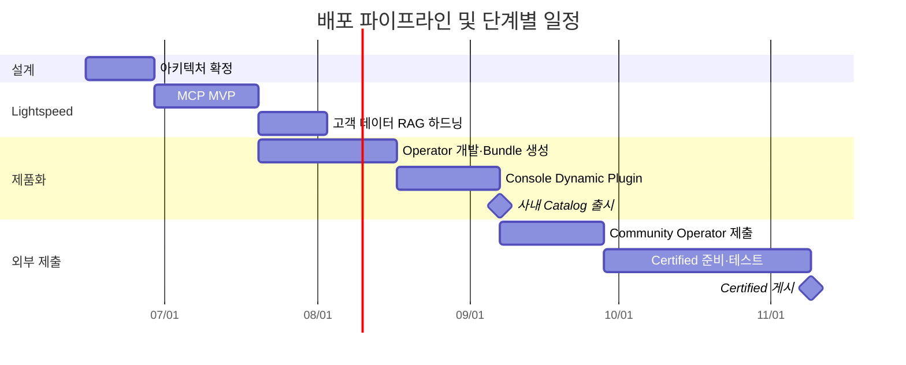
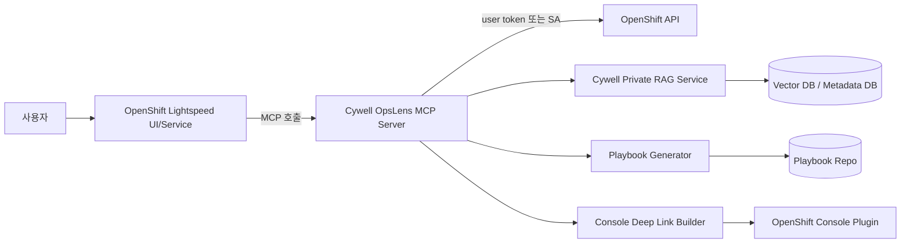
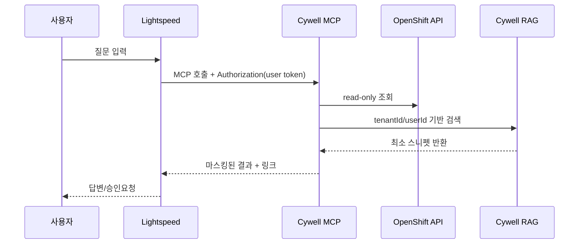

# Cywell OpsLens 단계별 실행 기획서

## Executive Summary

본 기획서의 핵심 권고는 **“Lightspeed 내 사용자 경험 검증은 먼저, 제품화의 중심축은 Operator와 Console Dynamic Plugin으로”** 입니다. 즉, **단기적으로는 Cywell OpsLens를 OpenShift Lightspeed의 커스텀 MCP 서버로 붙여 사용성·가치 가설을 검증**하고, **중기적으로는 Operator + Console Plugin + 사내용 카탈로그 배포 체계**를 갖춘 뒤, **최종적으로 Community Operator와 Red Hat Certified Operator 경로**로 진입하는 순서를 권장합니다. 그 이유는 Red Hat 공식 문서상 **OpenShift Lightspeed의 커스텀 MCP 서버 기능과 BYO Knowledge 기능이 모두 Technology Preview**이며, Red Hat이 **프로덕션 SLA 대상이 아니라고 명시**하고 있기 때문입니다. 반면, **Operator 번들링, 카탈로그 배포, ConsolePlugin, Community/Certified Operator 제출 경로는 이미 문서화된 정식 워크플로**입니다. 따라서 시장/고객 검증은 Lightspeed에서 빠르게 하고, 제품 신뢰성·운영성·배포성은 Operator 제품화 축에서 확보하는 것이 가장 현실적입니다. citeturn5view5turn9view0turn11search4turn5view2turn16view2

고객 데이터 반영 방식은 특히 보수적으로 설계해야 합니다. Red Hat 문서는 **BYO Knowledge 사용 시 문서를 LLM 제공자에게 직접 제공한다**고 밝히고 있고, 또한 **OLSConfig의 queryFilters/redaction을 설정하더라도 MCP 도구가 반환한 콘텐츠는 필터링되지 않은 채 LLM에 보일 수 있다**고 설명합니다. 이 두 사실을 합치면, **민감한 고객 문서나 운영 데이터 원문을 Lightspeed BYOK나 MCP 응답에 그대로 싣는 방식은 위험**합니다. 따라서 본 계획서는 **고객 데이터 RAG를 Cywell 소유의 별도 Retrieval 서비스로 분리**하고, **테넌트별 접근통제·서버사이드 마스킹·최소 스니펫 반환·감사로그·암호화**를 기본값으로 하는 구성을 권고합니다. 다시 말해, **Lightspeed는 “질문 오케스트레이션 계층”, Cywell RAG는 “데이터 정책 집행 계층”**으로 역할을 분리해야 합니다. citeturn9view0turn9view1turn29view1turn9view3

권한 모델도 같은 원칙으로 설계해야 합니다. OpenShift Lightspeed는 커스텀 MCP 서버에 대해 헤더 값 소스로 **`secret`**, **`kubernetes`**(사용자 bearer token 전달), **`client`**를 지원합니다. 또한 Red Hat 문서는 **민감한 작업은 Human-In-The-Loop 승인으로 제어**해야 하며, Observability MCP 서버는 **비읽기 작업에서 승인 UI를 트리거**한다고 설명합니다. 따라서 Cywell OpsLens의 MVP는 **읽기 전용 도구(read-only) 중심**으로 시작하고, 쓰기 작업은 2단계 이후에만 제한적으로 열어야 합니다. 읽기 작업은 가능하면 **사용자 토큰 전달 방식**으로 사용자의 실제 OpenShift RBAC를 그대로 따르게 하고, 불가피한 공용 진단 도구만 **별도 읽기 전용 ServiceAccount**를 쓰는 방식이 안전합니다. citeturn29view1turn6view0turn6view1turn29view3

사내용 배포 채널은 **내부 카탈로그를 먼저 구축**하는 것이 맞습니다. Red Hat은 최근 문서에서 **File-Based Catalog가 최신 형식이며, 기존 SQLite 카탈로그 형식을 대체**한다고 명시합니다. 동시에 OpenShift의 **CatalogSource는 여전히 이미지 기반 카탈로그를 참조하는 실무 경로**로 널리 쓰이며, `image`, `sourceType`, `secrets`, `updateStrategy.registryPoll.interval` 같은 제어 필드를 제공합니다. 그러므로 본 계획서는 **개발 파이프라인은 FBC 기준으로 정렬**하고, **현재 사내 OpenShift 표준이 CatalogSource 중심이라면 CatalogSource 소비 레이어를 함께 유지**하는 이중 호환 전략을 권고합니다. 이렇게 하면 현재 배포 현실과 향후 OLM 방향성을 동시에 잡을 수 있습니다. citeturn24view1turn24view2turn25view0turn25view4turn26view0turn26view1

Community Operator와 Certified Operator는 순차 진입이 효율적입니다. Community 경로는 Red Hat OpenShift Ecosystem의 canonical repository를 통해 이뤄지며, **자동 vetting CI + 수동 리뷰**가 적용됩니다. Certified 경로는 별도의 Red Hat Partner Connect 및 certification workflow를 요구하며, **Operator bundle이 참조하는 모든 컨테이너가 먼저 Red Hat 인증을 받아 Ecosystem Catalog에 게시돼 있어야** 합니다. 또한 Red Hat hosted pipeline 문서는 **신규 인증에는 FBC 사용을 권장**하고, 인증 성공 시 **Container Catalog와 OpenShift 내 embedded OperatorHub로 게시**된다고 설명합니다. 귀사가 이미 파트너사인 점은 분명 유리하지만, 실무적으로는 **문서/지원/테스트/호환성 정보까지 포함한 제품 수준 준비**가 완료되어야 빨라집니다. citeturn14view4turn30view2turn16view0turn16view1turn21view0turn20view4

결론적으로, **최단 가치 실현 경로는 “Lightspeed MCP PoC → Operator/Console Plugin 내부 출시 → Community 제출 → Certified 완료”** 입니다. 이 경로는 기술 리스크와 사업 리스크를 동시에 낮춥니다. 먼저 Lightspeed에서 현장 반응과 프롬프트/툴 UX를 검증하고, 이후 Operator 기반으로 설치·업그레이드·감사·보안·지원 체계를 고도화한 뒤, 외부 공개 카탈로그로 확장하는 것이 **가장 빠르면서도 가장 덜 위험한** 경로입니다. 특히 **고객 데이터는 MCP/BYOK에 바로 싣지 말고, Cywell 통제형 RAG 계층을 통해 최소화된 결과만 반환**하는 원칙이 이 계획의 성공을 좌우합니다. citeturn5view5turn9view0turn29view1turn16view2

## 권고안과 MVP 범위

### 권고안 요약

| 선택지 | 장점 | 한계 | 현재 권고 |
|---|---|---|---|
| Lightspeed MCP만 먼저 | OpenShift 내 즉시 노출, 사용자 학습비용 낮음, AI 도구 UX 검증이 빠름 | 커스텀 MCP는 Technology Preview, 운영 SLA 불가, 고객 데이터 보안 설계가 까다로움 citeturn5view5turn29view1 | **PoC/설계 파트너 한정** |
| Operator만 먼저 | 안정적 설치·업그레이드·카탈로그·지원 체계 확보, Community/Certified 진입 용이 citeturn5view3turn24view1turn16view0 | 초반 사용자 접점이 Lightspeed보다 약함 | **제품화의 중심축** |
| 권고 조합 | MCP로 UX 검증 + Operator로 제품화 + Plugin으로 콘솔 노출 | 초반 아키텍처 설계 난이도 약간 상승 | **최종 권고안** |

### 채널별 비교

| 구분 | 사내 Catalog | Community Operator | Certified Operator |
|---|---|---|---|
| 주요 목적 | 내부 고객·설계 파트너 배포 | 공개 배포·인지도 확보 | 상용 신뢰도·공동 지원 체계 |
| 리뷰 주체 | 사내 아키텍트/보안/플랫폼팀 | community hosted pipeline + 수동 리뷰 citeturn14view4turn30view2 | Red Hat certification workflow + hosted/local certification pipeline citeturn16view0turn16view1 |
| 배포 위치 | 사내 레지스트리·사내 OperatorHub | `community-operator-index` 기반 OpenShift/OKD 카탈로그 citeturn5view0 | Red Hat Ecosystem Catalog 및 Red Hat in-product catalogs citeturn20view4turn5view2 |
| 지원 기대치 | 사내 SLA 기준 | 커뮤니티 중심 | Red Hat 기준 요건 + 공동 지원 기대치 citeturn16view2 |
| 진입 장벽 | 낮음 | 중간 | 높음 |
| 예상 기간 | 8~11주 | 추가 3~4주 | 추가 6~8주 |

### 최소 기능 범위

| 우선순위 | 기능 | MVP 포함 여부 | 비고 |
|---|---|---|---|
| 높음 | Lightspeed MCP에서 클러스터 상태 요약 조회 | 포함 | 읽기 전용 |
| 높음 | 고객 문서 기반 “운영 플레이북 생성” | 포함 | **Cywell private RAG 경유** |
| 높음 | Console Dynamic Plugin 대시보드 | 포함 | Cluster Health / Playbook / Links |
| 높음 | Operator 설치·업그레이드·제거 | 포함 | 번들/카탈로그 기준 |
| 높음 | 사내 CatalogSource 통한 배포 | 포함 | 내부 출시 기준 |
| 중간 | Community Operator 제출 | 포함 | 내부 안정화 후 |
| 중간 | Certified Operator 제출 | 조건부 포함 | 내부/커뮤니티 검증 후 |
| 낮음 | Lightspeed에서 직접 조치 실행 | 제외 | 초기엔 쓰기 작업 미개방 |
| 낮음 | BYO Knowledge로 민감 고객 문서 직접 적재 | 제외 | 프라이버시 위험 및 Preview 제약 citeturn9view0turn9view1 |

## 단계별 실행 로드맵

### 단계별 실행 표

| 단계 | 목표 | 산출물 | 책임자 | 예상 기간 | 필요 인력/역량 | 주요 위험요인 및 완화책 | 테스트/검증 기준 |
|---|---|---|---|---|---|---|---|
| 아키텍처 확정 | MVP 범위, 데이터 정책, 권한모델, 배포 채널 결정 | 제품 요구사항서, 위협모델, RACI, API 목록, 릴리스 기준서 | Product Owner, Solution Architect | 2주 | 아키텍트, 플랫폼, 보안, PM | Lightspeed Preview 기능을 과신할 위험 → PoC 범위를 “내부/설계 파트너 한정”으로 명시 citeturn5view5turn9view0 | 승인된 아키텍처 문서, MVP 스코프 freeze |
| Lightspeed MCP MVP | Cywell OpsLens MCP 서버를 Lightspeed에 연결하여 질의/응답 UX 검증 | MCP 서버, OLSConfig, 툴 스펙, read-only 도구 3~5개 | Backend Lead, Platform Engineer | 3주 | Go/Python 백엔드, OpenShift, LLM tool-calling | MCP 출력은 queryFilters 보호 밖일 수 있음 → 서버사이드 마스킹·정책엔진 필수 citeturn9view1 | 10개 핵심 질문 중 8개 이상에서 기대 도구 선택/응답 |
| 고객 데이터 RAG 하드닝 | 민감정보를 보호하는 Cywell 전용 RAG 계층 구축 | 인덱싱 파이프라인, 벡터DB 스키마, 테넌트 정책, 감사로그 | Data/ML Engineer, Security Engineer | 2주 | 데이터 파이프라인, 검색, 보안, 프라이버시 | BYOK는 문서를 LLM provider에 직접 제공 → 민감정보는 별도 RAG 서비스로 격리 citeturn9view0 | 테넌트 간 데이터 누출 0건, PII 마스킹 검증 통과 |
| Operator 제품화 | 설치/업데이트/삭제를 Operator로 표준화하고 번들 생성 | CRD/Controller, bundle, annotations, scorecard config | Operator Lead | 4주 | Operator SDK, OLM, RBAC, CI/CD | 범위 과도 확대 → 단일 핵심 CRD와 한 개 제어 루프로 시작 권고 citeturn37view1 | `bundle validate`, `scorecard`, 설치/업그레이드 통과 |
| 사내 Catalog 배포 | 내부 레지스트리와 CatalogSource로 반복 배포 경로 확보 | catalog image/FBC, CatalogSource YAML, Subscription YAML, 설치 문서 | Platform Engineer, SRE | 2주 | opm, registry, OLM 운영 | SQLite 경로에 과도 의존 → FBC 기준으로 생성하고 필요 시 CatalogSource 소비 레이어 유지 citeturn24view1turn26view1 | 새 버전 게시 후 30분 내 클러스터 인지, 설치 성공 |
| Console Dynamic Plugin | OpenShift 콘솔에서 OpsLens UI 노출 | plugin frontend, backend service, ConsolePlugin CR | Frontend Lead | 3주 | React, OpenShift Console SDK, HTTPS Service | 콘솔-플러그인 네트워크/인증 이슈 → service cert, service proxy, network policy 사전 검증 citeturn32view4turn33view0turn34search0 | 플러그인 로드 성공, 콘솔 오류 0건, RBAC별 화면 차등 노출 |
| Community Operator 제출 | 공개 카탈로그 진입 | `operators/<pkg>` 구조, `ci.yaml`, `catalog-templates`, PR | Release Manager | 3주 | OSS 제출 경험, 문서화, 패키징 | DCO/구조/검증 실패 → 사전 체크리스트와 dry-run 검증 사용 citeturn30view0turn30view1turn31view1 | PR pipeline green, maintainer review 통과 |
| Certified Operator 완료 | Red Hat 공인 제품화 | Partner Connect listing, certified bundle PR, 증적 문서 | Partner PM, Release Manager | 6~8주 | 인증, 지원정책, 문서, QA | 모든 관련 컨테이너 선인증 누락 위험 → 선행 certification gate 설정 citeturn16view0 | hosted/local certification pipeline 통과, catalog 게시 확인 |

### 배포 파이프라인 및 일정



### 인력 및 비용 추정

아래 추정은 **가정 기반 예시**입니다. 실제 단가가 미지정이므로, 총액은 **인월 × 가정 단가** 방식으로 제시합니다.

| 역할 | 평균 투입률 | 예상 인월 | 비고 |
|---|---:|---:|---|
| Product Owner / PM | 0.3 | 1.5 | 요구사항·파트너 조율 |
| Solution Architect | 0.4 | 2.0 | 전체 아키텍처/보안 |
| Backend / MCP Engineer | 1.0 | 5.0 | MCP/RAG/API |
| Operator Engineer | 1.0 | 5.0 | CRD/Controller/OLM |
| Console Plugin Frontend | 0.5 | 2.5 | React/UI |
| SRE / Platform | 0.5 | 2.5 | 레지스트리/카탈로그/운영 |
| Security / QA | 0.5 | 2.5 | 테스트/위협모델/컴플라이언스 |
| **합계** |  | **21.0 인월 내외** | Community까지 약 13~15 인월, Certified 포함 시 18~21 인월 수준 |

| 비용 가정 | 값 |
|---|---:|
| 1인월 단가 가정 | 1,500만 원 |
| Community까지 추정 | 1.95억~2.25억 원 |
| Certified까지 추정 | 2.7억~3.15억 원 |
| 미지정 항목 | 라이선스, 모델 사용료, 보안 점검, 외부 인증 대응 인건비 외 별도 비용은 **미지정** |

## Lightspeed MCP 통합 설계

OpenShift Lightspeed는 `OLSConfig`에서 **커스텀 MCP 서버를 활성화**할 수 있으며, 헤더를 통해 **secret**, **client**, 또는 **사용자 Kubernetes bearer token**을 전달할 수 있습니다. 또한 Lightspeed는 **query-based tool filtering**과 **tool approval** 개념을 제공하므로, Cywell OpsLens는 처음부터 “툴 개수 최소화, 읽기/쓰기 분리, 승인 필요 작업 식별” 원칙으로 설계하는 것이 맞습니다. 특히 Red Hat은 **많은 도구를 한 번에 프롬프트에 싣는 것은 성능과 비용을 악화**시키므로 filtering을 권장하고, 민감한 작업은 **approvalType**으로 제어할 수 있다고 설명합니다. citeturn5view5turn7view0turn6view0

### 아키텍처



이 아키텍처에서 핵심은 **OpenShift Lightspeed는 질문 분기와 툴 호출만 담당**하고, **실제 데이터·권한·보안 정책 집행은 Cywell 계층에서 수행**한다는 점입니다. Lightspeed의 기본 Observability MCP는 클러스터 읽기 컨텍스트 수집을 위해 OpenShift API를 사용하고, 커스텀 MCP 역시 같은 패턴을 따를 수 있습니다. 다만 Red Hat 문서상 **MCP와 cluster interaction은 Technology Preview**이므로, 이 아키텍처는 **초기에는 내부/설계 파트너용**, 제품의 공식 운영 경로는 Operator와 Plugin으로 가져가는 것이 현실적입니다. citeturn29view1turn29view2

### MCP Tool 인터페이스 명세

MVP에서는 도구 수를 줄이고 역할을 명확히 해야 합니다. 권장 인터페이스는 아래와 같습니다.

| Tool 이름 | 목적 | 권한 성격 | 승인 필요 | 비고 |
|---|---|---|---|---|
| `get_cluster_signal` | 네임스페이스/워크로드/이벤트/상태 요약 | 읽기 | 아니오 | MVP 핵심 |
| `generate_playbook` | 상황 요약 기반 실행계획/플레이북 생성 | 읽기 | 아니오 | 고객 RAG 연동 |
| `retrieve_customer_knowledge` | 고객 문서/런북/정책 검색 | 읽기 | 아니오 | **민감문서 원문 직접 반환 금지** |
| `open_console_deep_link` | 관련 OpenShift 콘솔 링크 생성 | 읽기 | 아니오 | Plugin 연동 |
| `run_preflight` | 설치 전 요구조건/호환성 점검 | 읽기 | 아니오 | Operator 사전점검 |
| `propose_remediation` | 조치안 초안만 생성 | 읽기 | 아니오 | 실제 적용은 제외 |
| `apply_remediation` | 클러스터 조치 실행 | 쓰기 | 예 | **MVP 제외** |

샘플 요청/응답 형식은 아래처럼 단순하게 잡는 것이 좋습니다.

```json
{
  "tool": "generate_playbook",
  "input": {
    "clusterId": "prod-seoul-01",
    "tenantId": "acme-bank",
    "namespace": "payments",
    "intent": "pod-crashloop-root-cause-and-recovery",
    "constraints": {
      "readOnly": true,
      "includeCustomerRunbooks": true,
      "maxDocuments": 5
    }
  }
}
```

```json
{
  "tool": "generate_playbook",
  "result": {
    "summary": "payments 네임스페이스의 API pod가 CrashLoopBackOff 상태입니다.",
    "suspectedCauses": [
      "잘못된 secret 참조",
      "DB 연결 정보 변경",
      "최근 rollout 이후 환경변수 누락"
    ],
    "recommendedSteps": [
      "이벤트/로그 확인",
      "secret 존재 및 키 검증",
      "최근 Deployment diff 검토",
      "이전 정상 revision과 비교"
    ],
    "citations": [
      "customer-runbook:payments-api-rollback",
      "cluster-event:pod/payments-api-7b6d"
    ],
    "consoleLinks": [
      "/k8s/ns/payments/pods",
      "/k8s/ns/payments/deployments/payments-api"
    ]
  }
}
```

### OLSConfig 예시

아래는 현재 문서에 나온 MCP 설정 패턴을 반영한 **예시 템플릿**입니다. 실제 필드 경로는 배포한 Lightspeed CRD 버전에 맞춰 최종 검증이 필요합니다. OpenShift Lightspeed는 커스텀 MCP 서버 정보, 헤더, CA ConfigMap, query filters, user data collection 플래그 등을 OLSConfig에서 제어할 수 있습니다. citeturn5view5turn28view0turn28view2

```yaml
apiVersion: ols.openshift.io/v1alpha1
kind: OLSConfig
metadata:
  name: cluster
spec:
  featureGates:
    - MCPServer
  mcpServers:
    - name: cywell-opslens
      url: https://cywell-opslens-mcp.cywell-opslens.svc.cluster.local
      timeout: 20
      headers:
        - name: Authorization
          valueFrom:
            type: kubernetes
        - name: X-Cywell-Api-Key
          valueFrom:
            type: secret
            secretRef:
              name: cywell-mcp-header
  ols:
    additionalCAConfigMapRef:
      name: cywell-trusted-certs
    queryFilters:
      - name: redact-ip
        pattern: '((25[0-5]|(2[0-4]|1\d|[1-9]|)\d)\.?\b){4}'
        replaceWith: <IP_ADDRESS>
    userDataCollection:
      feedbackDisabled: true
      transcriptsDisabled: true
```

중요한 점은 **queryFilters가 MCP 응답까지 보호하지는 않는다는 것**입니다. Red Hat 문서는 MCP 도구가 반환한 내용은 필터링 밖에 있을 수 있다고 명시하므로, **민감정보 제거는 반드시 Cywell MCP 서버/백엔드에서 선행**되어야 합니다. citeturn9view1

### RBAC 및 ServiceAccount 설계

Red Hat 문서는 Lightspeed가 `kubernetes` 타입 헤더를 통해 **사용자 bearer token**을 전달할 수 있다고 설명합니다. 이를 활용하면 Cywell OpsLens가 **사용자 컨텍스트 기반 읽기 작업**을 수행할 수 있습니다. 즉, 사용자가 볼 수 있는 네임스페이스/리소스만 보이게 함으로써 별도의 권한 복제를 줄일 수 있습니다. citeturn29view1

권장 ServiceAccount 분리는 아래와 같습니다.

| ServiceAccount | 역할 | 권한 범위 |
|---|---|---|
| `cywell-opslens-operator-controller` | CRD/Deployment/Service/ConsolePlugin 관리 | 제품 설치에 필요한 최소 cluster-scoped 권한 |
| `cywell-opslens-mcp-read` | 공용 진단 read-only fallback | `get/list/watch` 중심 |
| `cywell-opslens-plugin-backend` | Console plugin proxy backend | Cywell API/RAG 통신만 |
| `cywell-opslens-rag-indexer` | 문서 인덱싱/임베딩 | 스토리지/DB 제한 권한 |

또한 Red Hat은 Operator 설계에서 **가능하면 scope와 RBAC를 줄일 것**을 권고하고, namespace-scoped operator는 유연한 배포와 격리를 제공한다고 설명합니다. 다만 Cywell OpsLens는 ConsolePlugin, ClusterRole, CatalogSource 같은 클러스터 리소스를 다룰 가능성이 높기 때문에 **MVP는 cluster-scoped control plane**으로 시작하되, 실제 데이터 수집/진단 동작은 **namespace allow-list**와 **read-only client**로 제한하는 절충안이 적절합니다. citeturn37view2

아래는 읽기 전용 예시입니다.

```yaml
apiVersion: v1
kind: ServiceAccount
metadata:
  name: cywell-opslens-mcp-read
  namespace: cywell-opslens
---
apiVersion: rbac.authorization.k8s.io/v1
kind: ClusterRole
metadata:
  name: cywell-opslens-readonly
rules:
  - apiGroups: [""]
    resources: ["pods", "services", "events", "configmaps", "namespaces"]
    verbs: ["get", "list", "watch"]
  - apiGroups: ["apps"]
    resources: ["deployments", "replicasets", "statefulsets", "daemonsets"]
    verbs: ["get", "list", "watch"]
  - apiGroups: ["route.openshift.io"]
    resources: ["routes"]
    verbs: ["get", "list", "watch"]
---
apiVersion: rbac.authorization.k8s.io/v1
kind: ClusterRoleBinding
metadata:
  name: cywell-opslens-readonly
subjects:
  - kind: ServiceAccount
    name: cywell-opslens-mcp-read
    namespace: cywell-opslens
roleRef:
  apiGroup: rbac.authorization.k8s.io
  kind: ClusterRole
  name: cywell-opslens-readonly
```

### 고객 데이터 RAG 연동 방식

Red Hat 문서는 BYO Knowledge를 통해 Markdown 문서를 이미지화해 RAG 데이터베이스로 공급할 수 있다고 설명하지만, 동시에 **문서를 LLM provider에 직접 제공**한다고 밝히고 있습니다. 이 기능은 문서화는 되어 있으나 Technology Preview이기도 하므로, **민감한 고객 데이터에는 권장되지 않습니다**. 대신 Cywell OpsLens는 아래와 같은 **사설 RAG 경로**를 사용하는 것이 바람직합니다. citeturn9view0turn9view1

| 방식 | 장점 | 한계 | 권고 |
|---|---|---|---|
| Lightspeed BYO Knowledge | Lightspeed 내장 경험과 잘 맞음 | 문서가 LLM provider로 직접 전달될 수 있음, Preview 기능 citeturn9view0 | **공개 문서·비민감 SOP에 한정** |
| Cywell Private RAG Service | 민감정보 통제, 테넌트 분리, 최소 응답 가능 | 구현 비용 증가 | **고객 데이터 기본 경로** |

권장 데이터 흐름은 다음과 같습니다.  
**수집 → 분류 → 정규화 → 청킹 → 임베딩 → 테넌트/문서 메타데이터 저장 → 질의 시 정책 필터 적용 → 최소 스니펫 반환 → LLM 요약**.  
여기서 핵심 통제는 **원문 직접 전달 금지**, **상위 N개 스니펫만 반환**, **PII/비밀값 마스킹**, **테넌트 ID와 사용자 권한 동시 검사**, **반환 결과 감사로그 기록**입니다. 이는 앞서 언급한 “MCP 응답은 Lightspeed queryFilters 보호 범위를 벗어날 수 있다”는 Red Hat 문서의 제약을 보완하기 위한 설계입니다. citeturn9view1turn9view3



## Operator 제품화와 카탈로그 경로

Red Hat과 Operator SDK 문서는 **bundle 생성이 카탈로그 배포의 첫 단계**라고 설명하며, bundle에는 CSV, CRD, 메타데이터, bundle.Dockerfile이 포함됩니다. 또한 Red Hat 최신 문서는 **File-Based Catalog가 최신 형식이며 deprecated SQLite를 대체**한다고 명시합니다. 동시에 OpenShift의 CatalogSource API는 여전히 이미지 기반 카탈로그와 polling 전략을 지원하므로, Cywell OpsLens는 **개발·검증은 FBC 기준**, **사내 배포는 CatalogSource 소비도 함께 유지**하는 전략이 가장 실용적입니다. citeturn5view3turn24view1turn24view2turn25view0

### Operator 개발·Bundle 생성·사내 Catalog 배포 절차

#### 개발 및 번들 생성 예시 명령어

```bash
# 프로젝트 초기화
operator-sdk init --domain cywell.io --repo github.com/cywell/cywell-opslens-operator

# CRD/API 생성
operator-sdk create api --group ai --version v1alpha1 --kind OpsLens --resource --controller

# 코드/매니페스트 생성
make manifests generate fmt vet

# 컨트롤러 이미지 빌드/푸시
make docker-build docker-push IMG=quay.io/cywell/cywell-opslens-operator:v0.1.0

# 번들 생성
make bundle IMG=quay.io/cywell/cywell-opslens-operator:v0.1.0 VERSION=0.1.0

# 번들 검증
operator-sdk bundle validate ./bundle --select-optional suite=operatorframework

# 스코어카드
operator-sdk scorecard ./bundle
```

`operator-sdk generate bundle`은 번들 생성을, `operator-sdk bundle validate`는 번들 규격과 선택적 카탈로그 기준 검증을, `scorecard`는 번들/CRD 품질 검증을 지원합니다. citeturn5view3turn23search0turn23search1turn22search2turn23search5

#### FBC 기반 카탈로그 이미지 생성 예시

```bash
mkdir catalog
opm generate dockerfile catalog -i registry.redhat.io/openshift4/ose-operator-registry-rhel9:v4.19

opm init cywell-opslens \
  --default-channel=stable \
  --description=./README.md \
  --icon=./operator-icon.svg \
  --output yaml > catalog/index.yaml

opm render quay.io/cywell/cywell-opslens-bundle:v0.1.0 \
  --output=yaml >> catalog/index.yaml

podman build -f catalog.Dockerfile -t quay.io/cywell/cywell-opslens-catalog:v0.1.0 .
podman push quay.io/cywell/cywell-opslens-catalog:v0.1.0
```

Red Hat 문서는 `opm generate dockerfile`, `opm init`, `opm render`를 사용하는 FBC 카탈로그 생성 절차를 제시합니다. citeturn26view2

#### CatalogSource 예시 템플릿

```yaml
apiVersion: operators.coreos.com/v1alpha1
kind: CatalogSource
metadata:
  name: cywell-opslens-catalog
  namespace: openshift-marketplace
spec:
  sourceType: grpc
  image: quay.io/cywell/cywell-opslens-catalog:v0.1.0
  displayName: Cywell OpsLens Catalog
  publisher: Cywell
  updateStrategy:
    registryPoll:
      interval: 30m
```

CatalogSource는 `sourceType`, `image`, `displayName`, `publisher`, `secrets`, `updateStrategy.registryPoll.interval` 등을 지원합니다. citeturn25view0turn25view4

#### Subscription 예시 템플릿

```yaml
apiVersion: operators.coreos.com/v1alpha1
kind: Subscription
metadata:
  name: cywell-opslens
  namespace: cywell-opslens
spec:
  channel: stable
  name: cywell-opslens
  source: cywell-opslens-catalog
  sourceNamespace: openshift-marketplace
  installPlanApproval: Manual
```

Subscription은 특정 catalog source와 channel에 대해 Operator 설치 의도를 표현합니다. 수동 승인 모드를 사용하면 운영 릴리스 게이트를 만들기 쉽습니다. citeturn27search4turn27search7turn27search9

#### CR 예시 템플릿

```yaml
apiVersion: ai.cywell.io/v1alpha1
kind: OpsLens
metadata:
  name: cluster
spec:
  lightspeed:
    enabled: true
    mcpServerUrl: https://cywell-opslens-mcp.cywell-opslens.svc.cluster.local
  plugin:
    enabled: true
  rag:
    mode: private
    tenantIsolation: strict
  features:
    playbookGeneration: true
    remediationApply: false
```

#### 번들 메타데이터 예시 템플릿

```yaml
# bundle/metadata/annotations.yaml
annotations:
  operators.operatorframework.io.bundle.package.v1: cywell-opslens
  operators.operatorframework.io.bundle.channels.v1: stable
  operators.operatorframework.io.bundle.channel.default.v1: stable
  com.redhat.openshift.versions: "v4.16-v4.19"
```

Red Hat 정책상 Operator bundle은 `com.redhat.openshift.versions`를 통해 지원 OpenShift minor version 범위를 명시해야 하며, CSV에는 `relatedImages` 및 각종 메타데이터 annotation이 필요합니다. citeturn21view0turn21view1

#### CSV annotation 예시 템플릿

```yaml
metadata:
  annotations:
    categories: "AI/Machine Learning,Monitoring"
    description: "Cywell OpsLens for OpenShift operational intelligence"
    containerImage: "quay.io/cywell/cywell-opslens-operator:v0.1.0"
    createdAt: "2026-06-12T00:00:00Z"
    support: "Cywell"
    operators.openshift.io/valid-subscription: "Contact Cywell"
    features.operators.openshift.io/disconnected: "true"
    features.operators.openshift.io/fips-compliant: "false"
    features.operators.openshift.io/proxy-aware: "true"
    features.operators.openshift.io/tls-profiles: "true"
```

### Community Operator 제출 요건과 PR 프로세스

Community Operator 경로의 canonical source는 `redhat-openshift-ecosystem/community-operators-prod` repository입니다. 이 저장소는 **OpenShift/OKD에 노출되는 Community Operators의 기준 저장소**이며, Red Hat은 **자동 vetting CI와 수동 리뷰를 함께 사용**한다고 밝힙니다. citeturn5view0turn14view4

공식 가이드에 따르면 제출자는 우선 **fork**, **DCO sign-off**, **`operators/<패키지명>/<버전>/manifests|metadata|tests` 구조**, **`ci.yaml`**, **`catalog-templates`**, **템플릿 Makefile**을 준비해야 합니다. PR 생성 후에는 **community hosted pipeline**이 실행되고, 모든 테스트가 green이면 merge 대상이 되며, merge 후 community release pipeline이 동작합니다. citeturn30view0turn30view1turn30view2turn31view0

`ci.yaml`은 reviewer 설정과 FBC 동작을 제어합니다. 공식 문서는 community operator에서 reviewer를 지정할 수 있고, FBC용 `enabled`, `version_promotion_strategy`, `catalog_mapping` 등을 넣을 수 있다고 설명합니다. citeturn31view0

```yaml
# operators/cywell-opslens/ci.yaml
reviewers:
  - souluk319
fbc:
  enabled: true
  version_promotion_strategy: review-needed
  catalog_mapping:
    - template_name: stable.yaml
      catalogs_names:
        - "v4.16"
        - "v4.17"
        - "v4.18"
        - "v4.19"
      type: olm.semver
```

OpenShift 배포를 위한 추가 기준으로는 **OperatorHub 공통 기준** 외에 **OpenShift 버전 범위 관리**, **deprecated API 회피**, **bundle validator 실행**이 요구됩니다. 가이드 문서는 `operator-sdk bundle validate ./bundle --select-optional suite=operatorframework`와 OCP 전용 검증기 사용을 제안합니다. citeturn31view1

또한 Red Hat 인증 정책은 **Operator 이름이 Community, Certified, Red Hat catalogs에 이미 존재하는 이름과 달라야 하며 Red Hat mark로 시작할 수 없다고 명시**합니다. 따라서 `Cywell OpsLens`라는 상품명은 적절해 보이지만, 실제 package name은 예를 들어 **`cywell-opslens`**처럼 고유성을 확보해야 합니다. citeturn20view0

### Red Hat Certified Operator 경로

Certified 경로는 Community보다 엄격합니다. Red Hat 공식 workflow는 다음 선행조건을 명시합니다.

| 요구사항 | 의미 |
|---|---|
| Partner Connect 가입 및 제품 listing | 파트너 온보딩 필수 citeturn5view2turn16view1 |
| Operator bundle이 참조하는 모든 컨테이너 사전 인증 | bundle 시작 전에 충족해야 함 citeturn16view0 |
| 지원 정책/문서/기능성/보안/수명주기 요건 충족 | certification policy 기준 citeturn16view2 |
| 신규 인증은 FBC workflow 권장 | 현재 권장 경로 citeturn16view1 |

Red Hat hosted pipeline 문서는 **certified-operators** upstream를 fork하고, bundle을 `operators` 디렉터리에 추가하며, 신규 인증에는 FBC 사용을 권장한다고 설명합니다. PR이 성공하면 **자동 병합 및 Red Hat Container Catalog, embedded OperatorHub 게시**가 가능하다고 명시합니다. citeturn16view1turn5view1

Certified readiness에서 특히 챙겨야 할 항목은 아래와 같습니다.

| 검증 항목 | 실무 포인트 |
|---|---|
| `com.redhat.openshift.versions` | 지원 minor version 명시 및 신버전 검증 체계 확보 citeturn21view1 |
| `relatedImages` | disconnected 운영 대비 필수 citeturn21view0 |
| FIPS / Proxy / TLS profiles annotation | 엔터프라이즈 운영성 증빙 citeturn21view0turn21view3turn21view4 |
| SCC 최소권한 | 가능하면 `restricted-v2` 수준 목표 citeturn21view2 |
| 지원 문서 | 설치/업그레이드/문제해결/제약사항 명시 |

**예상 추가 기간**은 내부 제품화 완료 이후 **6~8주**가 현실적입니다. 이미 파트너사라는 점은 온보딩 시간을 단축하지만, **컨테이너 사전 인증·운영 문서·지원 체계·호환성 검증**이 누락되면 오히려 병목이 됩니다. citeturn16view0turn16view1turn16view2

## Console Dynamic Plugin 설계

Red Hat은 OpenShift Dynamic Plugin을 **런타임에 로드되는 콘솔 확장**으로 정의하고, **OLM Operator를 통해 배포하는 것이 한 가지 표준 경로**라고 설명합니다. 또한 ConsolePlugin CR이 plugin을 등록하고, **cluster administrator가 console operator configuration에서 활성화**한다고 명시합니다. Dynamic plugin은 **custom pages, perspectives, nav items, resource tabs/actions**를 추가할 수 있습니다. citeturn11search4turn33view0turn32view4

Cywell OpsLens Plugin의 권장 구조는 다음과 같습니다.

| 컴포넌트 | 역할 |
|---|---|
| `frontend` | Console extension UI, charts, links, playbook panel |
| `plugin service` | `plugin-manifest.json`, JS asset 제공용 HTTPS Service |
| `plugin backend` | Cywell API/RAG/cluster proxy 요청 처리 |
| `service proxy` | Console backend가 in-cluster HTTPS service로 프록시 |

ConsolePlugin API는 backend service와 proxy를 정의할 수 있고, proxy는 `/api/proxy/plugin/<plugin>/<alias>/...` 경로를 통해 호출됩니다. 또한 `authorization: UserToken`이면 **로그인 사용자의 OpenShift access token**을 프록시 요청에 담을 수 있으며, 그렇지 않으면 `None`을 사용할 수 있습니다. 서비스는 HTTPS여야 하고, 기본적으로 service CA bundle을 사용합니다. citeturn32view0turn32view3turn33view0

### ConsolePlugin 예시 템플릿

```yaml
apiVersion: console.openshift.io/v1
kind: ConsolePlugin
metadata:
  name: cywell-opslens-console
spec:
  displayName: Cywell OpsLens
  backend:
    type: Service
    service:
      name: cywell-opslens-plugin
      namespace: cywell-opslens
      port: 9443
      basePath: /
  proxy:
    - alias: opslens-api
      authorization: UserToken
      endpoint:
        type: Service
        service:
          name: cywell-opslens-plugin-backend
          namespace: cywell-opslens
          port: 8443
```

### Console operator 활성화 예시

```yaml
apiVersion: operator.openshift.io/v1
kind: Console
metadata:
  name: cluster
spec:
  plugins:
    - cywell-opslens-console
```

### Service serving certificate 예시

OpenShift는 Service에 `service.beta.openshift.io/serving-cert-secret-name` annotation을 달면 서비스인증서 secret을 생성할 수 있습니다. Dynamic plugin backend와 service proxy는 HTTPS를 요구하므로 사실상 필수입니다. citeturn32view4turn34search0turn34search2

```yaml
apiVersion: v1
kind: Service
metadata:
  name: cywell-opslens-plugin
  namespace: cywell-opslens
  annotations:
    service.beta.openshift.io/serving-cert-secret-name: cywell-opslens-plugin-tls
spec:
  selector:
    app: cywell-opslens-plugin
  ports:
    - name: https
      port: 9443
      targetPort: 9443
```

실제 운영 시 plugin JavaScript는 **`consolefetch` API 사용**, **`plugin-manifest.json` 정상 노출**, **`openshift-console` 네임스페이스에서 오는 트래픽 허용용 NetworkPolicy**가 필요합니다. Red Hat 문서는 플러그인이 보이지 않을 때 확인할 체크리스트로 이 항목들을 직접 제시하고 있습니다. citeturn33view0

## 검증·운영·보안 계획

### PoC 및 테스트 플랜

| 테스트 영역 | 테스트 케이스 | 성공 기준 |
|---|---|---|
| Lightspeed MCP 연결 | Lightspeed 질문이 Cywell MCP 도구로 라우팅되는지 확인 | 대표 질문 10건 중 8건 이상 적절한 도구 선택 |
| 권한 제어 | 사용자 A/B가 서로 다른 네임스페이스만 조회 가능한지 확인 | 허용 리소스만 노출, 무단 데이터 노출 0건 |
| 고객 RAG | 테넌트 간 문서 검색 차단, 마스킹 적용 확인 | 교차 테넌트 누출 0건, 민감값 마스킹 100% |
| Console Plugin | 플러그인 로드, 탭/페이지 노출, deep link 동작 | 로드 오류 0건, 3초 내 초기 화면 노출 |
| Operator 설치/업그레이드 | fresh install, minor upgrade, uninstall, reinstall | 데이터/CR 무결성 유지, 업그레이드 성공 |
| Catalog 배포 | 새 bundle 게시 후 CatalogSource polling 반영 | 30분 내 새 버전 감지 |
| 장애 내성 | MCP backend down, RAG timeout, cert 만료 | 의미 있는 오류메시지, 복구 runbook 존재 |
| 성능 | 대표 질의 P95 응답시간 측정 | 8초 이내 목표 |
| 보안 | secret 노출 탐지, audit log 적재, NetworkPolicy 검증 | Critical 이슈 0건 |
| 제출 준비 | `bundle validate`, `scorecard`, OpenShift-specific validation | 필수 validator 모두 통과 |

### 배포·운영·업데이트·롤백 절차

Operator 기반 운영에서는 **자동 업데이트보다 통제된 승인 흐름**이 중요합니다. Subscription은 channel/source를 지정하며, `installPlanApproval: Manual`을 사용하면 운영팀이 업그레이드 타이밍을 통제할 수 있습니다. 특정 시작 CSV를 지정하는 패턴도 공식 문서에 예시가 있습니다. citeturn27search7turn27search9

권장 운영 절차는 아래와 같습니다.

| 절차 | 실행 내용 |
|---|---|
| 배포 | 새 operator image → bundle image → catalog image 순으로 생성/푸시 후 staging CatalogSource 갱신 |
| 검증 | staging cluster에서 install plan 승인, smoke test 수행 |
| 승격 | production catalog tag 갱신 또는 GitOps merge |
| 업데이트 | Manual approval로 운영 승인 후 적용 |
| 롤백 | **공식 의미의 downgrade를 기대하지 말고**, 사전 검증된 이전 bundle/catalog + CR 백업/복원 조합으로 대응 |
| 핫픽스 | 같은 channel 내 긴급 patch 버전 추가, install plan 수동 승인 |
| 감사 | 변경 티켓, install plan 승인 이력, operator event/log 연계 저장 |

여기서 가장 중요한 운영 원칙은 **“롤백을 기능이 아니라 제품 책임으로 설계”**하는 것입니다. 즉, 이전 버전 bundle 보존, CRD 스키마 호환성 정책, 백업/복원 절차, downgrade 지원 범위를 문서화해야 합니다.

### 보안·컴플라이언스 체크리스트

| 항목 | 체크 내용 | 권고 |
|---|---|---|
| Secret 관리 | MCP header secret, DB credential, registry pull secret | Kubernetes Secret + 외부 vault 연동 |
| TLS/신뢰 | MCP/Plugin/RAG의 사설 CA 신뢰 | `additionalCAConfigMapRef`, service CA, custom CA 적용 citeturn28view0turn32view4turn34search0 |
| Proxy | 외부 LLM/registry 접근 프록시 설정 | `proxyConfig`와 proxy-aware 점검 citeturn28view4turn21view3 |
| 감사로그 | 도구 호출, 문서 검색, 승인 이벤트 저장 | SIEM 연계 |
| RBAC | 읽기/쓰기 SA 분리, 사용자 토큰 우선 | least privilege |
| NetworkPolicy | console → plugin, MCP → RAG/API 최소 허용 | default deny 권장 citeturn33view0 |
| SCC / Pod Security | 가능하면 restricted 수준에서 동작 | `restricted-v2` 목표 citeturn21view2turn37view0 |
| Disconnected | 관련 이미지 모두 `relatedImages` 등록 | Certified 준비 필수 citeturn21view0 |
| FIPS | 실제 지원 가능 여부 명확화 | 미지원이면 false 명시 citeturn21view0 |
| 사용자 데이터 수집 | feedback/transcript 저장 여부 | 기본은 비활성 권장 citeturn28view2turn28view3 |
| 민감정보 통제 | BYOK 대신 private RAG 우선 | 고객 원문 직접 전달 금지 citeturn9view0turn9view1 |
| OpenShift 버전 호환성 | `com.redhat.openshift.versions`, max OCP version 관리 | 사전 호환성 테스트 필수 citeturn21view1turn31view1 |

### 열린 쟁점과 한계

현재 공식 문서 기준으로도 **OpenShift Lightspeed의 MCP, cluster interaction, BYO Knowledge, PostgreSQL persistence 일부는 Technology Preview**입니다. 따라서 본 계획서는 이 축을 **PoC/초기접근 채널**로 보되, **정식 상용 제품 경로는 Operator/Plugin/카탈로그**에 두는 전제를 사용했습니다. 또한 Lightspeed CRD의 세부 필드 경로는 릴리스별로 다를 수 있으므로, 실제 적용 전에는 **설치한 버전의 CRD/문서와 일치 여부를 마지막으로 검증**해야 합니다. citeturn5view5turn9view0turn38view0

## 출처 링크

| 문서 | 활용 목적 | 출처 |
|---|---|---|
| Red Hat OpenShift Lightspeed Configure | MCP, BYOK, query filters, approvals, user data collection, CA, quota | citeturn5view5turn6view0turn7view0turn9view0turn9view1turn28view0turn28view2turn29view1turn38view0 |
| ConsolePlugin API | plugin backend/proxy/service CA/HTTPS 요건 | citeturn5view4turn32view0turn32view3turn32view4 |
| OpenShift Web Console Dynamic Plugins | plugin enablement, service proxy, UserToken, troubleshooting | citeturn11search4turn33view0 |
| OpenShift Operators / Catalogs 문서 | FBC, SQLite deprecation, `opm` 명령, CatalogSource/Subscription | citeturn24view1turn24view2turn26view0turn26view1turn25view0turn27search4turn27search9 |
| Operator SDK docs | bundle generate/validate, scorecard, scope, multiple service accounts | citeturn5view3turn23search0turn23search1turn22search2turn23search5turn36search0turn37view2 |
| community-operators-prod repo 및 operator-pipelines 가이드 | Community 제출 구조, `ci.yaml`, PR 프로세스, DCO | citeturn5view0turn14view4turn30view0turn30view1turn30view2turn31view0turn31view1 |
| certified-operators repo 및 certification workflow | Certified 제출, Partner Connect, FBC 권장, hosted pipeline | citeturn5view1turn5view2turn16view0turn16view1 |
| Red Hat OpenShift Software Certification Policy Guide | 이름 고유성, annotations, supported versions, SCC, in-product catalogs | citeturn16view2turn20view0turn21view0turn21view1turn21view2turn21view3turn21view4turn20view4 |
| OpenShift certificate docs | service serving cert, injected CA bundle | citeturn34search0turn34search2 |

