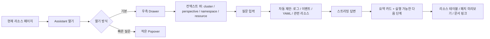
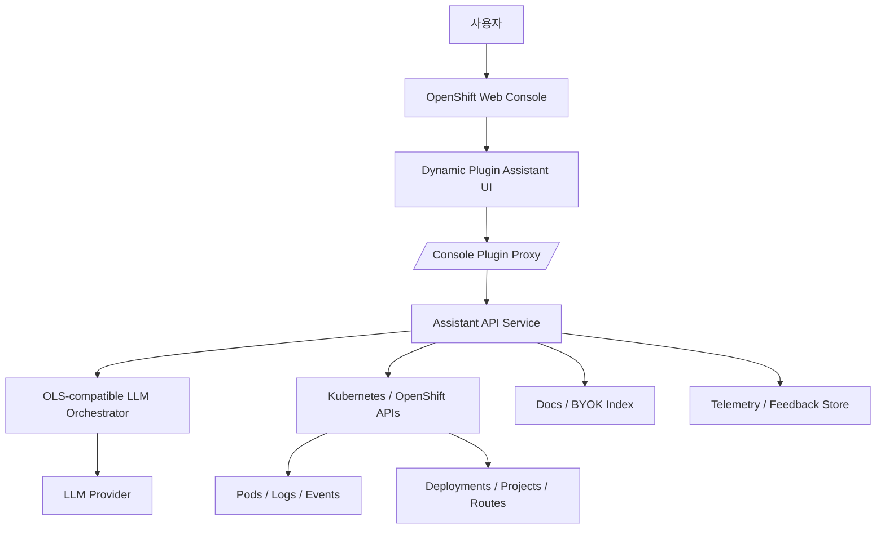

# Red Hat OpenShift 웹 콘솔과 Lightspeed 사용성 피드백 분석 보고서

## 경영 요약

공개 커뮤니티 신호를 종합하면, OpenShift 웹 콘솔의 가장 큰 사용성 문제는 **고급 작업이 여전히 YAML·CLI 중심으로 흘러간다**는 점, **프로젝트·네임스페이스·퍼스펙티브 문맥이 자주 끊긴다**는 점, **대량 작업·집계 뷰가 약하다**는 점, 그리고 **리소스가 많은 환경에서 느려지고 플러그인 전환 시 재렌더·리로드가 발생한다**는 점으로 요약된다. GitHub 이슈, Reddit, Stack Overflow에서 반복적으로 관찰된 불만은 “GUI가 초보자용 요약판에 가깝고, 실제 운영은 결국 YAML/CLI로 내려간다”는 방향으로 수렴한다. citeturn46view0turn45search5turn45search1turn13view1turn23search11turn15view0turn25view0turn26view1

Lightspeed 자체의 **직접적인 공개 불만**은 아직 많지 않다. 다만 이는 “문제가 없다”가 아니라, **공개 신호가 아직 부족하다**는 뜻에 가깝다. 근거는 세 가지다. 첫째, 현재 공개 `lightspeed-console` 저장소 이슈 검색에는 chat/popover/accessibility 관련 유의미한 공개 이슈가 거의 없고, 둘째, Reddit의 Lightspeed 소개·BYOK 글도 실질적 토론이 거의 없으며, 셋째, 공식 구현 문서상 현재 UI가 “모든 콘솔 페이지 위에 뜨는 floating popover”이고, 대화 이력도 페이지 새로고침 시 유지되지 않는다. 즉, **차단형(popover) UX와 세션 지속성 부족은 실제 사용자 불만으로 커지기 쉬운 구조적 리스크**다. citeturn19view2turn19view3turn45search10turn45search2turn29view0turn33view0

따라서 대체/오버레이 챗봇을 설계할 때는 “더 똑똑한 답변”보다 먼저 **비차단형 배치**, **현재 페이지·네임스페이스·리소스 문맥 유지**, **권한에 맞춘 정보만 보이기**, **집계형 리소스 요약**, **대화 지속성**, **저비용 캐싱과 스트리밍**을 우선해야 한다. 구현은 OpenShift 동적 플러그인 + 서비스 프록시 + Kubernetes/Console API 조회 + OLS 호환 백엔드 조합이 가장 현실적이다. citeturn35search2turn35search8turn29view0turn30view0turn33view2turn44view0

## 조사 범위와 신뢰도

본 보고서는 공개적으로 접근 가능한 **공식 문서**, **`openshift/console` 및 `openshift/lightspeed-console` GitHub 이슈/리포지터리**, **Reddit r/openshift**, **Stack Overflow**를 우선 소스로 사용했다. 문항별 “빈도 추정”은 통계가 아니라, **독립된 공개 신호 수**를 바탕으로 한 정성적 추정이다. 대략적으로 High는 4개 이상 독립 신호, Medium은 2–3개, Low는 1개 또는 공식 한계 문서만 있는 경우로 보았다. 공식 문서는 원인·아키텍처·권한·프라이버시 확인에 사용했고, 커뮤니티 소스는 실제 불편의 방향성을 잡는 데 사용했다. citeturn35search2turn35search8turn29view0turn33view0turn33view1turn33view2turn45search5turn45search1turn23search11

중요한 한계는 **Lightspeed 전용 공개 불만 데이터가 아직 희소하다**는 점이다. 현재 공개 `lightspeed-console` 저장소 이슈 검색 결과는 사실상 비어 있고, Reddit의 Lightspeed 소개 글들도 댓글·토론이 빈약하다. 따라서 본 보고서의 **콘솔 전반 불만 우선순위**는 신뢰도가 높지만, **“Lightspeed popover가 화면을 막는다”는 항목은 직접 불만 집계보다 구현 구조와 제품 제약에서 도출한 위험 분석**의 성격이 더 강하다. 이 점을 각 섹션에 명시했다. citeturn19view2turn19view3turn45search10turn45search2turn29view0turn33view0

## 우선순위가 높은 불만 목록

| 우선순위 | 불만 유형 | 대표 인용 | 빈도 추정 | 영향도 | 근거 해석 |
|---|---|---|---|---|---|
| 매우 높음 | YAML·CLI 우회가 여전히 필요함 | “without manually modifying the corresponding yaml files” citeturn46view0 | High | High | OCP 4에서 UI 편집 기능이 축소되었다는 GitHub 이슈, “most resources emphasize using the CLI over the GUI”라는 Reddit 질문, “shift to yaml view to get an example”라는 Reddit 조언이 같은 방향을 가리킨다. 즉, GUI는 탐색에는 유용하지만 실작업은 YAML/CLI로 내려가는 경향이 강하다. citeturn46view0turn45search5turn45search1 |
| 매우 높음 | 프로젝트·네임스페이스 문맥 전환이 번거롭고 헷갈림 | “This can happen several times a minute” citeturn13view0 | Medium-High | High | 현재 프로젝트로 “빨리 돌아가기”가 어렵고, 프로젝트 드롭다운에 접근 권한 없는 프로젝트가 보여 “confusion and non-optimal user experience”를 만든 사례가 있다. RBAC/퍼스펙티브 구성이 복잡하다는 Reddit 질문도 같은 맥락이다. citeturn13view0turn14view1turn45search15 |
| 높음 | 대량 작업과 집계 뷰가 약함 | “without having to click delete every single resource by itself” citeturn14view0 | Medium | High | “전체 삭제”, “클러스터 전역에서 특수 리소스 소비 찾기” 같은 운영 작업은 웹 콘솔보다 CLI/jsonpath 쪽으로 기울어 있다. Stack Overflow의 GPU 특수 리소스 질문은 이런 집계 부재를 잘 보여준다. citeturn14view0turn23search11 |
| 높음 | 리스트 정보 밀도가 낮고 중요한 행이 화면 밖으로 밀림 | “I can only see two rows” citeturn15view0 | Medium | Medium-High | 레이블 노출 방식 때문에 실제 업무에서 필요한 행 수가 줄어들고, 좁은 공간에서 스캔 효율이 떨어진다. 이는 챗봇이 우하단을 덮는 패턴과 결합될 때 더 심해질 가능성이 크다. citeturn15view0turn29view0 |
| 높음 | 리소스가 많은 네임스페이스/플러그인에서 느림, 리로드·재렌더가 보임 | “Loading is very slow, Sometimes crash” citeturn25view0 / “redundant page reload” citeturn26view1 | Medium | High | 토폴로지 페이지 대량 리소스 환경에서 느리고 때때로 크래시하며, 퍼스펙티브 전환 API는 같은 URL에서도 `navigate()`를 호출해 재렌더·리로드를 유발했다. 챗봇 같은 동적 플러그인은 이 비용에 직접 노출된다. citeturn25view0turn26view1 |
| 중간 | 특수 리소스·GPU 사용 현황을 한눈에 보기 어렵다 | “want to locate those pods easily in whole cluster” citeturn23search11 | Medium | High | 특수 리소스는 일반 CPU/메모리처럼 1급 UX로 승격돼 있지 않다. 별도 NVIDIA GPU 콘솔 플러그인이 존재한다는 사실 자체가 기본 콘솔의 집계 UX 공백을 시사한다. citeturn23search11turn23search2turn23search10 |
| 중간 | Lightspeed의 대화 지속성과 popover 배치가 장기 작업에 불리함 | “Conversation history does not persist” citeturn33view0 / “floating popover chat window” citeturn29view0 | Low confidence | Medium-High | 이 항목은 **직접 커뮤니티 불만은 적고**, 공식 제품 한계와 구현 구조에서 나온 위험 신호다. 공식 문서는 아이콘이 우하단에 있으며 새로고침 시 대화 이력이 사라진다고 적고, 구현 문서는 채팅창이 모든 페이지 위에 뜨는 floating popover라고 밝힌다. 공개 토론이 적다는 점까지 감안하면, 이 문제는 “발현 전 위험”으로 보는 편이 정확하다. citeturn33view0turn29view0turn45search10turn45search2 |

### 해석

가장 강한 패턴은 단순하다. **OpenShift 콘솔은 “학습용/탐색용 화면”과 “실제 운영 작업” 사이의 간극이 아직 크다.** 그래서 사용자는 결국 YAML, CLI, jsonpath, 또는 별도 플러그인으로 내려간다. Lightspeed는 이 간극을 메우기 위해 들어왔지만, 현재처럼 우하단 popover 중심으로 얹히면 **콘솔의 기존 정보 밀도·문맥 전환·성능 문제를 해결하기보다 덮어버릴 위험**이 있다. citeturn46view0turn45search5turn45search1turn14view0turn23search11turn29view0turn33view0

## 불만을 낳는 UI와 아키텍처 원인

| 불만 | UI/아키텍처 원인 | 세부 설명 | 설계 시사점 |
|---|---|---|---|
| YAML·CLI 의존 | **YAML-first UX** | UI 편집이 일부 리소스·일부 필드만 커버하고, 고급 작업은 YAML 편집이나 CLI가 더 빠르다. Lightspeed 설정을 외부 Route로 노출하는 절차조차 공식 문서가 YAML 생성·적용을 전제로 한다. citeturn46view0turn33view2 | 챗봇이 YAML을 “대체”하려 하기보다, **폼+요약+안전한 패치 생성기** 역할을 해야 한다. |
| 프로젝트·네임스페이스 혼란 | **console tabs / perspective / multi-cluster context** | 프로젝트 드롭다운과 퍼스펙티브 상태가 분리돼 있고, 동적 플러그인에서 `setActivePerspective()`가 같은 URL에도 `navigate()`를 발생시켜 현재 문맥을 잃게 만들었다. 권한 없는 프로젝트가 드롭다운에 노출된 사례도 있었다. citeturn13view0turn14view1turn26view1 | 챗봇은 **현재 namespace/project/perspective를 고정된 컨텍스트 바**로 항상 표시해야 한다. |
| 대량 작업·집계 부족 | **resource model fragmentation** | Pod, Deployment, Event, Project, Logs 등이 다른 API와 다른 화면에 흩어져 있다. “모든 리소스 삭제”나 “GPU 소비 Pod 찾기” 같은 운영 작업은 집계 화면이 약하다. citeturn14view0turn23search11turn44view0 | 챗봇은 답변만 하지 말고 **aggregated resource view**를 함께 제공해야 한다. |
| 리스트 정보 밀도 저하 | **table layout / accessibility debt** | 레이블 행이 리스트 공간을 잡아먹고, 작은 화면·오버레이 UI와 결합하면 가시성이 급락한다. 콘솔 자체 스타일 가이드도 WCAG 2.1 AA, 키보드 내비게이션, 스크린리더 기준을 요구한다. citeturn15view0turn28search1 | 채팅 UI는 화면을 덮는 popover보다 **도킹 가능한 drawer**가 안전하다. |
| 성능 저하 | **over-fetching / re-render / route coupling** | 리소스 수가 많을 때 토폴로지 로딩이 느리고 크래시가 보고되었으며, 플러그인 퍼스펙티브 전환에서도 불필요한 `navigate()`로 재렌더가 발생했다. citeturn25view0turn26view1 | 실시간 watch 남용 대신 **질문 중심의 lazy fetch + 짧은 TTL 캐시**가 낫다. |
| 챗봇이 화면을 막을 위험 | **popover modality** | Lightspeed 구현은 “floating popover chat window”, 공식 사용법은 우하단 아이콘 클릭 흐름이다. 이미 릴리즈 신호에는 “OpenShift Lightspeed button position fix”, “popover close button text overlap” 같은 오버레이 관련 버그가 보인다. citeturn29view0turn33view0turn17search16turn17search9 | 기본 배치는 **비차단형 inline drawer**로 바꾸고, popover는 quick-help 용 서브 모드로만 남겨야 한다. |
| 권한 혼란 | **binary RBAC + visible-but-not-usable affordance** | 공식 문서에 따르면 OpenShift Lightspeed는 모든 사용자가 버튼을 볼 수 있지만, 권한 있는 사용자만 질문을 보낼 수 있다. 이는 “보이지만 못 쓰는” UX를 만든다. citeturn33view2 | 권한 없으면 버튼 대신 **잠금 상태 배지 + 요청 절차**를 보여주는 편이 낫다. |

## 권장 디자인 변경과 기술 해법

### 권장 UI 배치

가장 안전한 기본값은 **우측 고정 drawer**다. 현재 페이지를 가리지 않도록 폭 조절·접기·핀 고정이 가능해야 하며, 긴 대화는 별도 “Assistant 페이지”로 승격할 수 있어야 한다. 빠른 질문만 필요한 경우에만 작은 popover를 허용하되, 이는 기본 모드가 아니라 **보조 모드**여야 한다. 이 판단은 현재 Lightspeed가 페이지 위로 뜨는 floating popover 구조이고, 공식 사용 흐름도 우하단 아이콘 중심이며, 대화 이력이 새로고침 시 사라진다는 점을 고려한 것이다. citeturn29view0turn33view0

| 배치안 | 권장도 | 장점 | 단점 | 권고 |
|---|---|---|---|---|
| 우하단 popover | 낮음 | 빠른 접근, 구현 단순 | 본문 가림, 좁은 화면 불리, 장기 대화 부적합 | quick-help 전용 |
| 우측 도킹 drawer | 매우 높음 | 비차단형, 컨텍스트 유지, 리사이즈 가능 | 초기 구현 비용 조금 큼 | **기본값** |
| 하단 패널 | 중간 | 로그/이벤트와 함께 보기 좋음 | 세로 공간 희생 | 로그 분석 모드에 적합 |
| 전용 Assistant 페이지 | 높음 | 긴 대화, 히스토리, 공유, 검색에 유리 | 페이지 전환 필요 | 고급 모드 |

### 권장 UI 플로우



### 구체적 변경 권고

첫째, **컨텍스트를 대화창 안이 아니라 대화창 바깥에 올려라.** 현재 namespace, project, perspective, selected resource, user role을 상단 컨텍스트 바에 명시하면 사용자는 “내가 지금 무엇을 보고 있는가”를 잃지 않는다. 이는 프로젝트 드롭다운 혼란과 퍼스펙티브 전환 리로드 문제를 정면으로 줄인다. citeturn13view0turn14view1turn26view1

둘째, **“답변”보다 “집계 카드”를 먼저 보여라.** 예를 들어 GPU 질문이면 “현재 GPU 요청 Pod 목록”, “노드별 allocatable/used”, “대기 중인 Pod”, “이벤트 요약”을 먼저 보여주고, 자연어 설명은 그 다음에 붙이는 편이 좋다. Stack Overflow의 특수 리소스 전역 탐색 요구와, 별도 NVIDIA GPU 콘솔 플러그인이 존재한다는 사실은 이 방향을 뒷받침한다. citeturn23search11turn23search2turn23search10

셋째, **YAML을 숨기지 말고, ‘안전한 생성물’로 낮춰라.** 사용자 요청을 받아 바로 YAML 편집기로 던지는 대신, “폼 → 구조화된 diff/patch → 선택적 YAML 보기” 흐름을 사용해야 한다. 특히 BuildConfig, DeploymentConfig, Route, ConsolePlugin, Route 생성 같은 작업에서 이 패턴이 중요하다. citeturn46view0turn33view2

넷째, **비차단형 피드백과 지속성을 기본 제공하라.** 공식 Lightspeed는 대화 피드백(thumbs up/down)을 수집하고, 대화 이력은 새로고침 시 사라진다. 대체 챗봇은 이 반대로 가야 한다. 즉, 대화는 로컬 또는 서버에 일정 시간 저장하고, 피드백은 답변 카드 옆에 직접 붙이며, 새로고침 후 복구 안내를 제공해야 한다. citeturn33view0turn33view1

### 권장 API와 캐시 전략

대체 챗봇은 두 부류의 API를 써야 한다. 하나는 **챗 백엔드 API**이고, 다른 하나는 **현재 클러스터 상태 조회 API**다. OLS 호환 백엔드라면 `/v1/query`, `/v1/streaming_query`, `/v1/mcp/client-auth-headers`를 사용할 수 있고, OpenShift 콘솔 동적 플러그인이라면 콘솔 프록시를 통해 `/api/proxy/plugin/<plugin-name>/<proxy-alias>/<request-path>` 형태로 백엔드와 통신하는 것이 표준이다. 실제 Lightspeed 플러그인도 `/api/proxy/plugin/lightspeed-console-plugin/ols` 프록시를 사용한다. citeturn30view0turn35search2turn29view0

클러스터 조회에는 최소한 아래 엔드포인트를 쓰면 된다.

```text
/api/v1/namespaces/{namespace}/pods
/api/v1/namespaces/{namespace}/pods/{name}
/api/v1/namespaces/{namespace}/pods/{name}/log
/apis/apps/v1/namespaces/{namespace}/deployments
/apis/apps/v1/namespaces/{namespace}/deployments/{name}
/apis/project.openshift.io/v1/projects
/apis/events.k8s.io/v1/namespaces/{namespace}/events
```

Pod, Deployment, Project, Event API 엔드포인트는 공식 API 문서에 정의되어 있다. citeturn44view0turn42search6turn38search3turn37search2

캐시는 **질문 단위 TTL 캐시**가 적합하다. 권장값은 리소스 요약 15–30초, 이벤트 10초, 로그 tail 3–5초, 피드백 제출 결과 0초다. watch 스트림은 항상 켜두지 말고, 사용자가 패널을 열었을 때와 특정 질문 유형에만 지연 로딩하는 편이 `Topology`류의 과잉 로딩 문제를 피하기 쉽다. 이 판단은 대규모 네임스페이스에서 느림/크래시가 보고된 사실과, 동적 플러그인 퍼스펙티브 전환이 리로드 비용을 유발한 사실에 근거한 설계 추론이다. citeturn25view0turn26view1

## OpenShift 내 대체 챗봇 구현 방안

### 권장 아키텍처



동적 플러그인 자체는 `ConsolePlugin` CR로 등록하고, 백엔드는 콘솔 프록시 뒤에 둔다. `ConsolePlugin`은 콘솔이 클러스터 내 다른 서비스에서 코드를 동적으로 로딩하는 확장 방식이고, 서비스 프록시는 HTTPS 기반으로 `/api/proxy/plugin/...` 경로를 제공한다. Lightspeed도 같은 패턴을 쓴다. citeturn35search0turn35search2turn35search8turn29view0

### 데이터 소스와 호출 방식

프런트엔드는 먼저 **현재 페이지 문맥**을 수집한다. 현재 URL, perspective, namespace/project, selected resource kind/name, 최근 이벤트/로그 탭 여부, 사용자가 수동 첨부한 항목이 1차 입력이다. 그런 다음 백엔드는 질문 유형에 따라 필요한 조회만 수행한다. 예를 들어 “왜 이 Pod가 Pending인가?”라면 Pod 상세, 관련 Events, 필요 시 Node 정보와 Scheduling failure reason까지 읽는다. Pod/로그/Event/Deployment/Project 엔드포인트는 공식 API로 직접 접근 가능하다. citeturn44view0turn42search6turn38search3turn37search2

OLS 호환 백엔드를 쓴다면 프런트엔드가 프록시를 통해 `/v1/streaming_query`를 호출하고, 서버는 스트리밍 응답을 그대로 전달하면 된다. MCP 서버 인증 헤더 요구 여부는 `/v1/mcp/client-auth-headers`로 확인할 수 있다. 공식 OLS OpenAPI 정의는 이 경로들을 명시한다. citeturn30view0

### RBAC와 권한 모델

권한 모델은 두 층이어야 한다. 첫 층은 **챗봇 인터페이스 사용 권한**이고, 둘째 층은 **질문에 필요한 리소스 조회 권한**이다. 공식 Lightspeed는 인터페이스 권한이 사실상 binary RBAC이며, 모든 사용자가 버튼은 보되 권한 있는 사용자만 질문을 제출할 수 있다. 이 UX는 혼란을 만들 수 있으므로, 대체 챗봇은 **버튼 노출 자체를 권한 기반으로 조정**하거나, 최소한 비활성 이유를 명확히 보여줘야 한다. citeturn33view2

리소스 조회 권한은 사용자의 기존 OpenShift 권한을 그대로 따라야 한다. 즉, Assistant는 새로운 우회 권한을 가져서는 안 된다. 구현 측면에서는 `SelfSubjectAccessReview`/`useAccessReview` 계열 체크를 선행하고, 읽기 권한이 없는 리소스는 “존재 여부”까지 최소화해서 숨기는 편이 안전하다. 공식 동적 플러그인 SDK 문서도 `useAccessReview` 사용을 안내한다. citeturn36search13turn32search8

### 텔레메트리와 모니터링 이벤트

최소 이벤트 스키마는 아래와 같다.

| 이벤트 | 의미 | 왜 필요한가 |
|---|---|---|
| `assistant_opened` | 패널/팝오버 열림 | 진입률 |
| `assistant_blocked_ui_escape` | 사용자가 패널을 급히 닫음 | 차단 UX 감지 |
| `message_sent` | 질문 발송 | 사용량 |
| `response_first_token_ms` | 첫 토큰 지연 | 체감 성능 |
| `response_complete_ms` | 완료 지연 | 품질/비용 |
| `context_attach_added` | 로그/이벤트/YAML 첨부 | 문맥 사용성 |
| `context_fetch_denied` | RBAC로 문맥 조회 실패 | 권한 설계 결함 |
| `chat_restore_success` | 새로고침 후 대화 복원 | 지속성 품질 |
| `feedback_positive/negative` | 답변 평가 | 품질 루프 |
| `prompt_too_long` | 413 발생 | 프롬프트/첨부 UX 보정 |

공식 릴리즈 신호에는 “Add telemetry to Lightspeed console capability”가 이미 보이고, 공식 문서에는 피드백 제출과 transcript/telemetry 수집이 정의되어 있다. 따라서 텔레메트리는 선택이 아니라 기본 기능으로 보는 것이 맞다. citeturn17search21turn33view0turn33view1

### 프라이버시와 보안 메모

OpenShift Lightspeed는 메시지와 클러스터 데이터를 **redaction layer**를 거쳐 LLM으로 보내지만, 공식 문서는 동시에 “private from the LLM”이어야 하는 정보는 입력하지 말라고 경고한다. 또 transcript와 feedback은 Red Hat Insights 체계를 통해 수집되며, 기본적으로 일정 주기로 전송된다. 즉, 대체 챗봇은 **전송 전 미리보기(redaction preview)**, **민감 필드 마스킹 표시**, **수집 옵트아웃 상태 표시**를 UI에 넣어야 한다. citeturn33view1

외부에서 API를 직접 호출해야 할 경우, OpenShift Lightspeed 서비스는 기본적으로 internal `ClusterIP`이고 외부 접근을 위해선 Route를 만들어야 하며, 공식 문서는 `reencrypt` TLS 종단을 권한다. 따라서 replacement 서비스도 기본값은 **cluster-internal only**, 외부 공개는 명시적 선택으로 두는 편이 안전하다. citeturn33view2

## MVP 백로그

| 우선순위 | 아이템 | 예상 노력 | 수용 기준 |
|---|---|---:|---|
| P0 | 우측 도킹 drawer 기반 챗 셸 | M | 기본 진입은 popover가 아니라 drawer이며, 리사이즈·접기·핀 고정이 가능하다. 본문 클릭 시 뒤 페이지 조작이 유지된다. |
| P0 | 컨텍스트 바 | S | cluster / perspective / namespace / resource kind/name이 항상 보이고, 질문 전환 시 자동 갱신된다. 권한 없는 문맥은 노출되지 않는다. |
| P0 | 스트리밍 질의 + 취소 | M | `/api/proxy/plugin/<plugin>/<alias>/v1/streaming_query`를 통해 응답이 토큰 단위로 보이고, 사용자가 즉시 취소 가능하다. citeturn35search2turn30view0 |
| P0 | 대화 지속성 복구 | M | 브라우저 새로고침 후 마지막 대화가 복구되거나, 적어도 복구 불가 이유와 새 대화 시작이 명확히 제시된다. 현재 Lightspeed의 페이지 리로드 시 대화 손실 한계를 개선한다. citeturn33view0 |
| P1 | 리소스 첨부와 자동 추천 | M | Pod/Deployment/Event/Logs 중 현재 페이지에 맞는 첨부 후보가 자동 제안되고, 사용자는 한 번에 추가할 수 있다. |
| P1 | 집계형 운영 카드 | L | “네임스페이스 문제 요약”, “Pending Pod”, “GPU 요청 Pod”, “최근 경고 Event” 같은 집계 카드가 표 형태로 먼저 보인다. Pod/Deployment/Event API를 사용한다. citeturn44view0turn42search6turn37search2 |
| P1 | RBAC 게이트와 이유 표시 | M | 권한이 없으면 버튼/입력창 상태가 일관되게 비활성화되고, “왜 못 쓰는지”와 요청 절차를 표시한다. “보이지만 못 쓰는” 상태를 제거한다. citeturn33view2 |
| P1 | 텔레메트리와 피드백 루프 | S | open, send, first-token, complete, deny, feedback 이벤트가 수집되고 대시보드에서 볼 수 있다. thumbs up/down과 자유 텍스트 피드백이 지원된다. citeturn33view0turn33view1turn17search21 |
| P2 | YAML-safe action generator | L | 사용자가 “환경변수 추가”, “Route 수정” 등을 요청하면 YAML 전체 편집이 아니라 form/diff/patch 미리보기 후 적용된다. |
| P2 | 민감정보 redaction preview | M | 전송 전 마스킹된 필드가 무엇인지 사용자가 확인할 수 있고, transcript 전송 상태/옵트아웃 상태가 표시된다. citeturn33view1 |
| P2 | 비차단 접근성 개선 | M | 키보드만으로 열기/닫기/탭 이동이 가능하고, 스크린리더 라벨이 제공되며, 작은 화면에서 본문 가림 비율이 정의된 임계치 이하로 유지된다. 콘솔 스타일 가이드의 WCAG 2.1 AA 요구를 충족한다. citeturn28search1 |

## 주요 출처 우선순위와 한계

### 우선순위가 높은 출처군

| 우선순위 | 출처군 | 이 보고서에서 사용한 이유 | 대표 근거 |
|---|---|---|---|
| 최상 | 공식 OpenShift / Lightspeed 문서 | 제품 한계, RBAC, privacy, telemetry, API/프록시 구조 확인 | Lightspeed 대화 이력 비지속성, RBAC binary, redaction/transcript, Route 노출, Dynamic Plugin proxy, ConsolePlugin 정의. citeturn33view0turn33view1turn33view2turn35search2turn35search0 |
| 최상 | `openshift/console` GitHub 이슈 | 실제 사용자 고통과 엔지니어링 원인 연결 | YAML 편집 요구, 프로젝트 드롭다운 혼란, bulk delete, labels row 문제, 토폴로지 성능, perspective reload. citeturn46view0turn13view0turn14view1turn14view0turn15view0turn25view0turn26view1 |
| 높음 | Reddit r/openshift | 초중급 사용자 체감, CLI vs GUI 인식, YAML 서사 | CLI vs GUI 질문, YAML Nightmare, Lightspeed 소개 글 반응 부족. citeturn45search5turn45search1turn45search10turn45search2 |
| 높음 | Stack Overflow | 집계/운영 관점의 빈틈 포착 | 특수 리소스(GPU) 소비 Pod를 클러스터 전체에서 쉽게 찾고 싶다는 질문. citeturn23search11 |
| 중간 | 릴리즈 상태/버그 타이틀 | 오버레이·버튼 위치·텔레메트리 관련 엔지니어링 신호 | Lightspeed 버튼 위치 수정, popover close button text overlap, telemetry 추가. citeturn17search16turn17search9turn17search21 |
| 중간 | `openshift/lightspeed-console` 저장소 문서 | 현재 챗 UI의 구체 구현 확인 | floating popover, proxy path, Redux state, resource attachment 흐름. citeturn29view0 |

### 한계와 미해결 질문

Lightspeed 전용의 공개 사용자 불만 데이터는 아직 얇다. 따라서 **popover가 실제로 얼마나 자주 “화면을 막는다”는 शिकायत으로 이어졌는지**를 정량화하기는 어렵다. 현 시점에서 확실히 말할 수 있는 것은, 현재 구현이 floating popover이고 대화 지속성이 약하며, 공개 토론 자체가 적다는 점이다. 즉, 본 보고서의 Lightspeed UI 제안은 **실사용 불만의 대규모 집계**라기보다 **콘솔 기존 불만 + 현 구현 구조**를 결합한 예방적 설계 권고다. citeturn29view0turn33view0turn19view2turn45search10

또 하나의 미해결 질문은 **멀티클러스터 콘텍스트를 어디까지 Assistant가 1차 개념으로 가져가야 하는가**다. 2026년 이슈는 custom perspective와 `all-namespaces` 경로 처리에서 실제 리로드·루프 문제가 있었음을 보여주지만, ACM 등 상위 제품과 결합한 UX 기준은 별도 제품 전략과 맞물린다. MVP에서는 우선 **현재 클러스터·현재 네임스페이스 문맥 고정**이 현실적이고, 멀티클러스터 질의는 P2 이후로 미루는 것이 안전하다. citeturn26view1