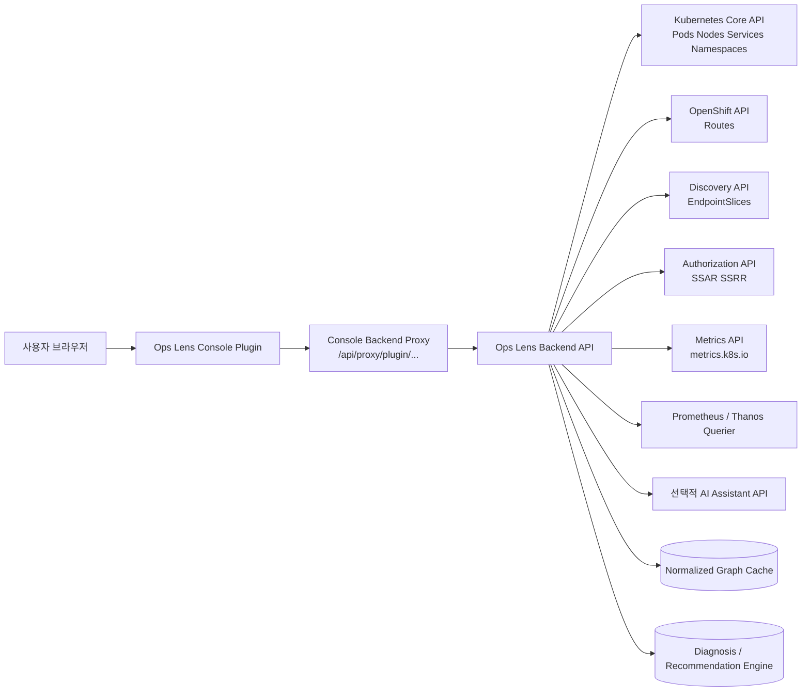
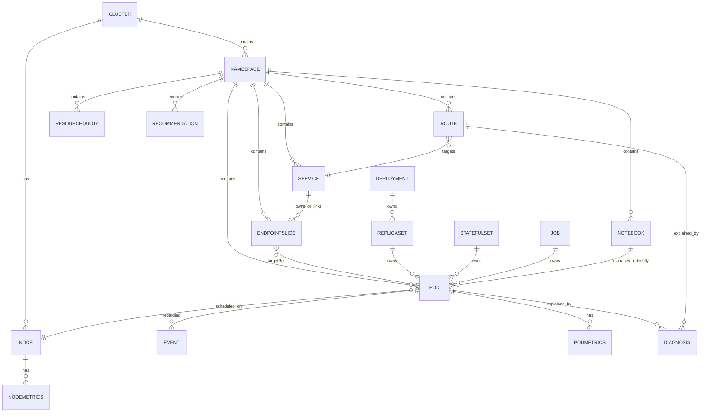
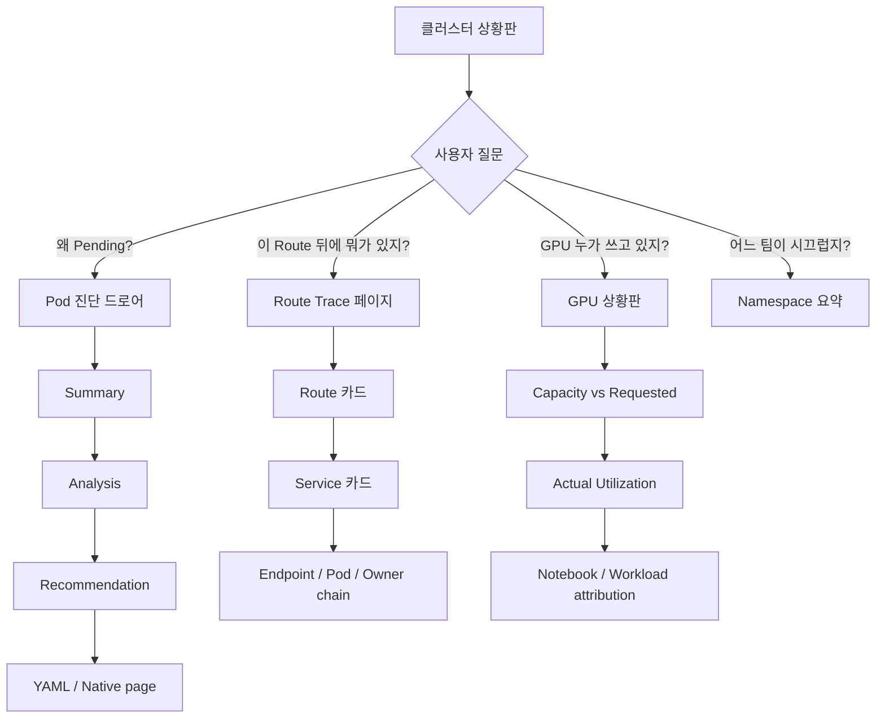
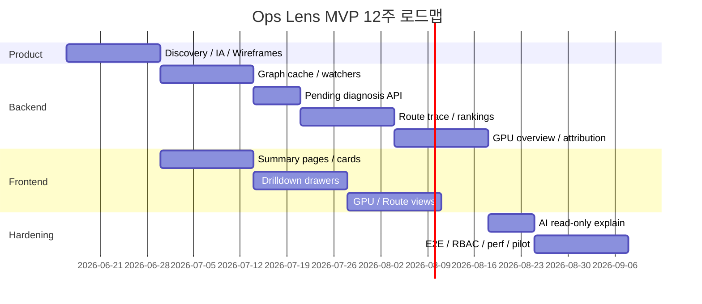

# Ops Lens 재설계 연구 보고서

## 핵심 요약

Ops Lens는 OpenShift 웹 콘솔을 갈아엎는 별도 제품이 아니라, **기존 콘솔의 확장 지점 위에 “사람이 질문하는 방식”으로 상태를 설명하는 진단 계층**을 얹는 방식이 가장 현실적입니다. OpenShift 콘솔은 동적 플러그인으로 **커스텀 페이지, 내비게이션, 리소스 페이지 탭/액션, 대시보드 카드, 클러스터·프로젝트 오버뷰 활용도 항목**을 런타임에 추가할 수 있고, 플러그인 백엔드는 콘솔의 서비스 프록시를 통해 **사용자 토큰을 전달받아** 인클러스터 HTTPS 서비스에 안전하게 연결할 수 있습니다. 콘솔 자체도 자신을 “single page webapp 형태의 more friendly kubectl”로 설명하고 있어, 재설계의 핵심은 “리소스 그래프와 이벤트를 사람 친화적으로 엮는 해석 계층”을 만드는 데 있습니다. citeturn5view1turn11view1turn11view3turn12view1

문제는 데이터가 없는 것이 아니라, **데이터가 흩어져 있다는 점**입니다. Pending Pod의 원인은 Pod phase, scheduler event, node allocatable, taint/toleration, extended resource 요청을 함께 봐야 드러나고, Route 추적도 Route의 `spec.to`와 `spec.port.targetPort`, Service selector, EndpointSlice, Pod owner chain을 이어야 한 번에 이해됩니다. OpenShift Cluster Observability Operator가 이미 “개별 알림 폭주”를 “incident timeline”으로 재구성하는 UI 플러그인 패턴을 보여주고 있으므로, Ops Lens는 이 패턴을 **GPU 경합, Pending 진단, Route 계보 추적, 멀티테넌트 요약**으로 확장하면 됩니다. citeturn20view0turn20view1turn18view0turn18view1turn19view0turn16view2turn29view3turn12view3

권고 아키텍처는 **OpenShift Console dynamic plugin + 인클러스터 진단 API + 선택적 AI 설명 서비스**입니다. 특히 GPU는 Kubernetes Metrics API가 기본적으로 **CPU/메모리만** 제공하므로, GPU 대시보드는 반드시 **스케줄러 수준의 사실**(`nvidia.com/gpu` capacity/allocatable/requested)과 **Prometheus/DCGM 기반 GPU telemetry**(utilization, memory, temperature 등)를 결합해야 합니다. OpenShift AI 환경을 쓰는 경우에는 `kubeflow.org/v1` `Notebook` CR을 그래프에 포함해 “누가 GPU를 쓰는가”를 워크벤치 단위까지 연결할 수 있습니다. citeturn23view1turn20view0turn32search2turn32search8turn31search7turn30view2turn5view3

권고안은 아래와 같습니다.

| 항목 | 권고 |
|---|---|
| 제품 형태 | OpenShift Console plugin 중심, 포크 금지 |
| MVP 범위 | GPU 상황판, Pending 자동 번역, Route→Service→Pod 추적, 리소스 Top, 네임스페이스 요약 |
| AI 기능 | **읽기 전용 설명**부터 시작, 추천은 하되 자동 조치는 금지 |
| 배포 방식 | 플러그인 + 백엔드 + Operator 패키징 |
| 1차 일정 | 12주 내 파일럿 가능 |
| 설계 원칙 | “요약 → 분석 → 권장 → YAML” 4단 드릴다운 |

## 우선순위 기능과 근거

OpenShift 4.19부터 웹 콘솔의 perspective가 기본적으로 통합되었기 때문에, Ops Lens는 “관리자용/개발자용을 완전히 분리하는 UI”보다 **역할 기반 필터링은 하되 정보 구조는 하나로 유지하는 설계**가 유리합니다. 즉, 같은 화면 안에서 “내가 볼 수 있는 것만 보이게” 하는 방향이 현재 콘솔 진화 방향과 맞습니다. citeturn12view3turn27view1

| 페르소나 | 대표 질문 | 가장 중요한 화면 | 성공 판단 |
|---|---|---|---|
| 플랫폼 관리자 | “클러스터 어디가 막혔지?”, “이 GPU 노드는 왜 비어 있는데 Pending이지?” | 클러스터 상황판, GPU 상황판, 네임스페이스 요약 | 장애 탐지와 용량 판단이 CLI 없이 가능 |
| SRE | “왜 Pending?”, “이 Route 뒤의 실제 백엔드는 뭐지?”, “이 이벤트 폭주가 어디서 시작됐지?” | Pending 진단, Route 계보 추적, 이벤트 타임라인 | 근거 있는 원인설명이 1~2 클릭 안에 나옴 |
| 데이터 사이언티스트 | “내 워크벤치가 왜 안 떠?”, “누가 GPU를 쓰고 있어서 내가 못 받지?” | GPU 경합 보기, Notebook/Workbench 연결 보기 | 자신의 작업 실패 원인을 사람말로 이해 |
| Product Owner | “팀별로 누가 많이 쓰고 막히는가?”, “이번 주 가장 시끄러운 프로젝트는?” | 멀티테넌트 요약, 리소스 Top, 추천 카드 | 비용·혼잡도·팀별 병목이 한눈에 보임 |

핵심 사용 사례와 우선순위는 아래와 같습니다.

| 우선순위 | 사용 사례 | 왜 먼저 해야 하나 | 필요한 주 데이터 | 근거 |
|---|---|---|---|---|
| P0 | GPU 경합 진단 | GPU는 extended resource라 과할당이 안 되고, 요청을 만족하지 못하면 Pod가 Pending에 머무릅니다. 실제 사용률은 Metrics API가 아니라 DCGM/Prometheus 계열에서 와야 하므로, “할당 가능 vs 실제 사용 중”을 함께 보여줘야 합니다. | Node capacity/allocatable, Pod GPU limits/requests, GPU labels, Prometheus/DCGM | citeturn20view0turn23view1turn31search7turn32search2 |
| P0 | Pending → 사람말 근본원인 번역 | Pending은 “아직 스케줄링 안 됨”과 “이미지 풀 중”을 모두 포함할 수 있고, scheduler는 `FailedScheduling` 이벤트를 남깁니다. 사용자는 phase만 봐선 원인을 이해하기 어렵습니다. | Pod phase/conditions, Events, Node allocatable, taints/tolerations | citeturn21search1turn20view0turn22search0turn20view1 |
| P0 | Route → Service → Pod 추적 | Route는 Service만 타깃할 수 있고, Service는 selector 또는 수동 EndpointSlice로 백엔드를 가리킵니다. 이 연결은 콘솔에서 분절적으로 보이기 쉽습니다. | Route, Service, EndpointSlice, Pod, ownerReferences | citeturn18view0turn18view1turn19view0turn16view1turn16view2turn36view0 |
| P1 | 리소스 Top 리스트 | CPU/메모리 상위 소비자는 Metrics API와 Prometheus 계열 데이터로 쉽게 랭킹화할 수 있고, 운영자가 가장 먼저 찾는 “시끄러운 것”을 바로 보여줄 수 있습니다. | Metrics API, Thanos/Prometheus, Pod metadata | citeturn23view1turn23view0turn5view3 |
| P1 | 멀티테넌트 요약 | Namespace와 ResourceQuota는 멀티유저 분리를 위한 기본 단위이고, Thanos Querier는 멀티테넌트 메트릭 집계를 지원합니다. | Namespace, ResourceQuota, LimitRange, Thanos | citeturn28search10turn28search0turn28search2turn5view3 |
| P1 | Notebook/Workbench 원인 연결 | OpenShift AI workbench는 `kubeflow.org/v1` `Notebook` CR을 통해 정의되므로, GPU 사용 주체를 데이터사이언스 자산까지 끌어올릴 수 있습니다. | Notebook CR, Pod, Node, PVC | citeturn5view0turn30view0turn30view2 |
| P2 | AI 추천과 자연어 진단 | 읽기 전용 설명은 가치가 크지만, 보안/정확성 통제가 선행되어야 합니다. | 진단 그래프, redaction, tool filtering | citeturn27view0turn35view2turn35view3 |

기능 우선순위 자체는 아래처럼 정리하는 것이 적절합니다.

| 기능 | 우선순위 | 이유 |
|---|---|---|
| GPU Dashboard | P0 | 사용자 체감이 가장 크고, 기존 콘솔의 맥락 부족을 가장 선명하게 해결 |
| Pending Auto-Translation | P0 | “왜 Pending인지 모른다”는 가장 반복적인 운영 질문 |
| Lineage / Tracing 버튼 | P0 | Route, Service, Pod, Owner chain을 1클릭으로 연결하는 것이 상황 인식의 핵심 |
| Resource Top Lists | P1 | 운영 triage 시작점으로 매우 유용 |
| Namespace / Tenant Summary | P1 | PO/팀 리드가 이해할 수 있는 언어로 용량과 혼잡 전달 |
| Recommendations | P1 | 설명 다음 단계로 자연스럽지만, 자동 조치는 금지 |
| AI Chat / Ask Ops Lens | P2 | 가치가 크지만 redaction, approval, audit 설계 후 도입 권장 |

## 제품 구조와 데이터 모델

Ops Lens의 권장 구조는 **프론트엔드는 Console plugin, 백엔드는 graph-normalizer + diagnosis engine, AI는 선택적 보조 서비스**입니다. 플러그인은 콘솔의 공식 확장점으로 붙고, 백엔드는 사용자 토큰을 전달받아 RBAC 범위 안에서만 K8s/OpenShift API와 모니터링 API를 조회합니다. 데이터 수집은 “대시보드용 1회성 GET 남발”이 아니라, **selector 기반 list/watch + 캐시 + 정규화 그래프**가 기본이어야 합니다. Kubernetes API는 label selector와 field selector를 지원하고, watch/list 패턴과 `410 Gone` 복구를 공식적으로 요구합니다. citeturn11view1turn16view0turn15view3turn21search11turn14search11



이 구조는 OpenShift가 공식적으로 제공하는 **dynamic plugin + proxy + monitoring plugin + networking plugin** 패턴과 잘 맞습니다. 특히 네트워킹 콘솔 플러그인은 이미 Services, Routes, Ingresses, NetworkPolicies 등의 전용 UI를 플러그인으로 제공하고 있어, Ops Lens가 네트워크 흐름 해석을 플러그인으로 넣는 데 전례가 있습니다. citeturn12view2turn5view1turn11view1

백엔드가 반드시 수집해야 할 데이터 원천은 아래와 같습니다.

| 리소스 / API | 핵심 필드 | 접근 패턴 | 용도 | 근거 |
|---|---|---|---|---|
| `Pod` | `status.phase`, `status.conditions`, `spec.containers[].resources`, `metadata.ownerReferences` | namespace/watch, pending field selector | Pending 원인, GPU 요청, owner chain | citeturn21search7turn20view0turn29view3 |
| `Event` / `events.k8s.io/v1` | `reason`, `action`, `regarding`, `type`, `message` | namespace/list recent | root-cause evidence | citeturn22search0turn22search7 |
| `Node` | `status.capacity`, `status.allocatable`, labels, conditions | cluster/list+watch | GPU capacity, node health, scheduling fit | citeturn33search7turn33search0turn33search5 |
| `Service` | `spec.selector`, `spec.ports[].targetPort` | ns/get | backend lookup, route resolution | citeturn19view0turn19view1 |
| `EndpointSlice` | `metadata.labels[kubernetes.io/service-name]`, `endpoints[].conditions`, `targetRef`, `nodeName` | ns/list by label selector | 실제 엔드포인트와 Pod 연결 | citeturn16view2turn36view0turn36view3 |
| `Route` | `spec.to`, `spec.port.targetPort`, `status.ingress` | ns/get/list | 외부 진입점 추적 | citeturn18view0turn18view1turn34view3 |
| `Deployment` / `ReplicaSet` / `StatefulSet` / `Job` | selector, replicas, owner chain | lazy fetch | Pod의 상위 워크로드 계보 | citeturn29view0turn16view3turn29view1turn29view2 |
| `Namespace`, `ResourceQuota`, `LimitRange` | hard/used quota, min/max/defaults | list | 멀티테넌트 요약, 추천 | citeturn28search10turn28search0turn28search2turn28search14 |
| `metrics.k8s.io/v1beta1` | `NodeMetrics`, `PodMetrics` CPU/Memory | point-in-time GET | CPU/메모리 Top | citeturn23view0turn23view1 |
| Prometheus / Thanos | PromQL results | read query | cluster-wide rankings, historical views | citeturn5view3turn9search2turn9search10 |
| `Notebook` CR | `apiVersion: kubeflow.org/v1`, `kind: Notebook`, `spec.template.spec` | optional watch | Workbench와 Pod/GPU 연결 | citeturn5view0turn30view0turn30view2 |
| `SelfSubjectAccessReview`, `SelfSubjectRulesReview` | `status.allowed`, allowed rules | on-demand POST | 버튼/액션 노출 제어 | citeturn20view3turn24view0 |

특히 **Route 추적 로직**은 다음 규칙을 백엔드에 내장해야 합니다.  
첫째, Route는 `spec.to`로 Service를 가리키며 `spec.port.targetPort`는 endpoint 포트를 지정합니다. 둘째, Service에 selector가 있으면 label selector로 Pod를 찾고, selector가 없으면 `kubernetes.io/service-name=<svc>` 라벨의 EndpointSlice를 조회해야 합니다. 셋째, EndpointSlice의 `targetRef`, `conditions.ready`, `nodeName`를 함께 보면 “어떤 Pod가 지금 실제 트래픽을 받을 준비가 되어 있는가”를 UI에서 설명할 수 있습니다. 이 예외 처리를 안 하면 외부 DB나 수동 백엔드를 가진 Service를 잘못 분석하게 됩니다. citeturn18view0turn19view0turn16view1turn16view2turn36view0turn36view3



## UI/UX 흐름과 와이어프레임

Ops Lens의 UX 원칙은 단순합니다. **리소스를 먼저 보여주지 말고, 질문을 먼저 보여줘야 합니다.** 현재 콘솔과 kubectl은 “객체 중심”이고, Ops Lens는 “상황 중심”이어야 합니다. 또한 Kubernetes Events는 공식적으로 best-effort supplemental data이므로, UI는 이벤트를 “정답”처럼 단정하지 말고 **증거 카드**로 다루어야 합니다. OpenShift의 incident detection UI가 관련 경보를 사건으로 묶어 timeline과 drilldown을 제공하는 것처럼, Ops Lens도 “증상 → 근거 → 권장 → 원본 YAML” 구조를 일관되게 적용하는 편이 좋습니다. citeturn12view3turn22search0turn12view1

권장 드릴다운 레벨은 다음 네 단계입니다.

| 레벨 | 보여줄 것 | 사용자 질문 |
|---|---|---|
| Summary | 한 줄 한국어 설명, 상태 배지, 심각도 | “무슨 일이야?” |
| Analysis | 원인 후보, 증거 이벤트, 관련 리소스 그래프 | “왜 그랬어?” |
| Recommendation | 실행 가능한 다음 단계, 영향 범위, 권한 필요 여부 | “그래서 뭘 해야 해?” |
| YAML | 원본 객체, 관련 필드 하이라이트, 네이티브 콘솔 이동 | “근거 원문은 뭔데?” |

대표 화면은 아래처럼 설계하는 것이 좋습니다.

**클러스터 상황판**

```text
+----------------------------------------------------------------------------------+
| Ops Lens                                                                        |
| [클러스터 요약] [GPU] [Pending] [Route Trace] [Namespaces] [Top Consumers]      |
+----------------------------------------------------------------------------------+
| 카드: 지금 가장 중요한 일                                                         |
| - Pending Pods 14   주요 원인: GPU 부족 6, PVC 대기 4, 이미지 pull 2             |
| - GPU Saturation 83%  요청 11 / 할당가능 8 / 실제활성 6                           |
| - Route Risk 3       Ready endpoint 0 인 Route 2개                                |
| - Noisy Namespaces   rhods-notebooks, team-a, platform-ci                        |
+----------------------------------------------------------------------------------+
| [상위 리소스 소비]                 | [최근 진단 추천]                              |
| Pod CPU Top 5                      | 1) GPU time-slicing 확인                     |
| Pod Memory Top 5                   | 2) 특정 Notebook 장기 점유 확인              |
| Namespace GPU Top 5                | 3) Route x 의 backend endpoint 0건 점검      |
+----------------------------------------------------------------------------------+
```

**Pending 진단 드로어**

```text
+---------------------------------------------------------------+
| Pod: gpu-smi-test / ns: gpu-test-kugnus                       |
| 상태: Pending   진단: "현재 클러스터에 nvidia.com/gpu 1개를   |
| 만족할 노드가 없습니다."                                      |
+---------------------------------------------------------------+
| 분석                                                           |
| - scheduler event: FailedScheduling                            |
| - message: 0/1 nodes are available: Insufficient nvidia.com/gpu|
| - requested GPU: 1                                             |
| - available nodes with GPU allocatable >=1: 0                  |
| - current GPU holder: rhods-notebooks/jupyter-nb-admin-0       |
+---------------------------------------------------------------+
| 권장                                                           |
| - 기존 GPU 점유 워크로드 종료/스케일다운 가능 여부 확인        |
| - time-slicing/MIG 정책 확인                                   |
| - GPU 노드 증설 또는 큐잉(Kueue) 적용 검토                     |
+---------------------------------------------------------------+
| [관련 오브젝트] [원본 YAML] [네이티브 Pod 페이지 열기]         |
+---------------------------------------------------------------+
```

**Route 계보 추적 화면**

```text
Route host
  -> target Service
    -> EndpointSlice A (ready 2, serving 2, terminating 0)
      -> Pod 1 (owner: ReplicaSet -> Deployment)
      -> Pod 2 (owner: ReplicaSet -> Deployment)
    -> EndpointSlice B (ready 0)
```

추천 플로우는 다음과 같습니다.



UI 컴포넌트 측면에서는 기존 콘솔 확장점을 최대한 활용하는 편이 좋습니다. OpenShift는 플러그인을 통해 **dashboard card**, **cluster overview utilization item**, **project overview utilization item**을 추가할 수 있으므로, MVP는 전면 대체 UI보다 “기존 오버뷰 안에 Ops Lens 카드”를 심고, 이후 별도 페이지를 확장하는 단계가 리스크가 낮습니다. citeturn11view3

## API 예시와 샘플 응답

Ops Lens 백엔드는 **상류 API(Kubernetes/OpenShift/Prometheus)**를 그대로 프론트에 노출하기보다, 프론트가 바로 렌더링할 수 있는 **정규화된 진단 API**를 제공하는 편이 좋습니다. 상류 API는 복잡하고 오브젝트 중심이며, 프론트가 상류 API를 직접 여러 번 엮기 시작하면 다시 “웹 콘솔 안의 또 다른 kubectl”이 됩니다. 대신 백엔드는 상류 API를 수집·결합하고, 프론트에는 질문 중심 스키마를 내보내야 합니다. 상류 API 예시는 아래와 같습니다. citeturn23view1turn34view3turn19view0turn16view2

| 목적 | 상류 API / 명령 | 핵심 포인트 | 근거 |
|---|---|---|---|
| Pending Pod 수집 | `GET /api/v1/pods?fieldSelector=status.phase=Pending` | field selector로 서버 측 필터링 | citeturn21search11 |
| Pod 메트릭 | `GET /apis/metrics.k8s.io/v1beta1/namespaces/{ns}/pods/{name}` | CPU/메모리만 제공 | citeturn23view1turn23view0 |
| Node 메트릭 | `GET /apis/metrics.k8s.io/v1beta1/nodes/{name}` | 노드 CPU/메모리 | citeturn23view1turn23view0 |
| Route 읽기 | `GET /apis/route.openshift.io/v1/namespaces/{ns}/routes/{name}` | `spec.to.name`, `spec.port.targetPort` 사용 | citeturn34view3turn18view0turn18view1 |
| Service→Pod 해석 | `GET /api/v1/namespaces/{ns}/services/{name}` + `pods?labelSelector=...` | selector 기반 | citeturn19view0turn19view1 |
| Service→Endpoint 해석 | `GET /apis/discovery.k8s.io/v1/namespaces/{ns}/endpointslices?labelSelector=kubernetes.io/service-name=<svc>` | selector 없는 Service도 지원 | citeturn16view1turn16view2 |
| 권한 확인 | `POST /apis/authorization.k8s.io/v1/selfsubjectaccessreviews` | 액션 가능 여부 판정 | citeturn20view3 |
| UI 노출 제어 | `POST /apis/authorization.k8s.io/v1/selfsubjectrulesreviews` | 버튼 show/hide 용도 | citeturn24view0 |
| GPU 요청 검사 | Pod spec의 `resources.limits["nvidia.com/gpu"]` | extended resource는 whole number, 과할당 불가 | citeturn20view0 |

자주 쓰게 될 `jsonpath` 계열 예시는 다음과 같습니다.

```bash
# GPU limit를 가진 Pod 찾기
oc get pods -A -o jsonpath='{range .items[*]}{.metadata.namespace}{" "}{.metadata.name}{" GPU="}{.spec.containers[*].resources.limits.nvidia\.com/gpu}{"\n"}{end}'

# Pending Pod만 보기
oc get pods -A --field-selector status.phase=Pending

# Service selector 보기
oc get svc my-service -n my-ns -o jsonpath='{.spec.selector}'

# Pod ownerReferences 보기
oc get pod my-pod -n my-ns -o jsonpath='{.metadata.ownerReferences}'
```

위 예시의 의미는 각각 **GPU 요청 유무**, **Pending 상태 서버 필터링**, **Service가 어떤 label set을 고르는지**, **Pod의 상위 owner가 무엇인지**를 빠르게 확인하는 데 있습니다. citeturn20view0turn21search11turn19view0turn29view3

Ops Lens가 프론트에 제공할 내부 API는 아래처럼 설계하는 것이 좋습니다.

| 내부 API | 용도 | 주요 응답 필드 |
|---|---|---|
| `GET /api/ops-lens/v1/diagnose/pods/{ns}/{name}` | Pending / CrashLoop / Waiting 진단 | `summary`, `severity`, `causes[]`, `evidence[]`, `recommendations[]`, `relatedResources[]`, `rawRefs[]` |
| `GET /api/ops-lens/v1/trace/routes/{ns}/{name}` | Route 계보 추적 | `route`, `services[]`, `endpointSlices[]`, `pods[]`, `owners[]`, `healthSummary` |
| `GET /api/ops-lens/v1/gpu/overview` | 클러스터 GPU 상황판 | `capacity`, `allocatable`, `requested`, `runningConsumers[]`, `nodeBreakdown[]`, `utilization[]`, `labels[]` |
| `GET /api/ops-lens/v1/summaries/namespaces` | 멀티테넌트 요약 | `namespaces[]`, `quota`, `usage`, `pendingCount`, `topConsumers`, `recommendations` |
| `POST /api/ops-lens/v1/ai/explain` | 자연어 설명 생성 | `answer`, `citations[]`, `confidence`, `redactionsApplied[]` |

샘플 응답은 아래 정도 수준이면 프론트엔드와 디자이너가 바로 작업할 수 있습니다.

```json
{
  "kind": "PodDiagnosis",
  "apiVersion": "opslens.io/v1alpha1",
  "summary": "이 Pod는 현재 GPU 자원이 부족해 스케줄링되지 못하고 있습니다.",
  "severity": "warning",
  "causes": [
    {
      "code": "INSUFFICIENT_GPU",
      "confidence": 0.97,
      "explanation": "요청한 nvidia.com/gpu=1을 만족하는 노드가 없습니다."
    }
  ],
  "evidence": [
    {
      "type": "Event",
      "reason": "FailedScheduling",
      "message": "0/1 nodes are available: 1 Insufficient nvidia.com/gpu."
    },
    {
      "type": "PodSpec",
      "path": "spec.containers[0].resources.limits.nvidia.com/gpu",
      "value": "1"
    }
  ],
  "recommendations": [
    "현재 GPU 점유 워크로드를 확인하세요.",
    "GPU 공유(time-slicing/MIG) 정책을 확인하세요.",
    "큐잉 또는 증설을 검토하세요."
  ],
  "relatedResources": [
    "pod/gpu-smi-test",
    "node/worker-0",
    "pod/rhods-notebooks/jupyter-nb-admin-0"
  ]
}
```

```json
{
  "kind": "RouteTrace",
  "apiVersion": "opslens.io/v1alpha1",
  "route": {
    "namespace": "my-ns",
    "name": "frontend",
    "host": "frontend.apps.example.com",
    "targetService": "frontend-svc",
    "targetPort": "http"
  },
  "services": [
    {
      "name": "frontend-svc",
      "selector": {
        "app.kubernetes.io/name": "frontend"
      }
    }
  ],
  "endpointSlices": [
    {
      "name": "frontend-svc-abc",
      "ready": 2,
      "notReady": 1
    }
  ],
  "pods": [
    {
      "name": "frontend-7d5fc9b8b9-abcde",
      "ready": true,
      "nodeName": "worker-1",
      "ownerChain": ["ReplicaSet/frontend-7d5fc9b8b9", "Deployment/frontend"]
    }
  ],
  "healthSummary": {
    "reachable": true,
    "degraded": false,
    "message": "Route는 backend를 찾았고, Ready endpoint가 2개 있습니다."
  }
}
```

```json
{
  "kind": "PodMetrics",
  "apiVersion": "metrics.k8s.io/v1beta1",
  "metadata": {
    "name": "kube-scheduler-minikube",
    "namespace": "kube-system"
  },
  "timestamp": "2022-01-27T19:24:31Z",
  "window": "30s",
  "containers": [
    {
      "name": "kube-scheduler",
      "usage": {
        "cpu": "9559630n",
        "memory": "22244Ki"
      }
    }
  ]
}
```

위 `PodMetrics` 예시는 Kubernetes 공식 문서의 Metrics API 샘플 구조를 축약한 것으로, Ops Lens가 CPU/메모리 Top 카드와 상세 drilldown을 만들 때 바로 사용할 수 있는 형태입니다. citeturn23view1

## 구현 로드맵과 인력

가장 현실적인 MVP는 **12주** 기준으로 잡는 것이 좋습니다. 이유는 기술 난도가 아주 높아서가 아니라, **데이터 연결 규칙과 RBAC/보안 통제**가 제품 가치의 대부분을 차지하기 때문입니다. 즉, 화면 자체보다 “설명 품질”이 중요하므로, 초기에 5개 사용 사례에 집중해 정확도를 올리는 편이 낫습니다. 플러그인은 OLM Operator로 배포하는 것이 표준적이며, OpenShift plugin template와 SDK를 그대로 출발점으로 삼는 것이 효율적입니다. 또한 PatternFly 버전은 대상 콘솔 버전에 맞춰야 하며, 4.19~4.21은 PF 6.x + 5.x, 4.15~4.18은 PF 5.x + 4.x 범위를 염두에 두는 것이 안전합니다. citeturn26view0turn12view0

| 마일스톤 | 기간 | 주요 결과물 |
|---|---:|---|
| Discovery & UX framing | 2주 | 정보구조, 핵심 진단 사전, wireframe, RBAC 모델 |
| Graph backend foundation | 2주 | list/watch 캐시, resource graph, Pending/Pod diagnosis API |
| Trace & ranking | 3주 | Route trace, owner chain, resource Top, namespace summary |
| GPU MVP | 2주 | GPU capacity/requested view, consumer attribution, Notebook 연결 |
| AI-assisted read-only explain | 1주 | redaction, evidence-based explain endpoint |
| Hardening & pilot | 2주 | E2E, RBAC 테스트, 성능 튜닝, 파일럿 배포 |



권장 팀 구성과 대략적인 공수는 아래 수준입니다.

| 역할 | 역할 설명 | 대략 공수 |
|---|---|---:|
| Product Owner / PM | 범위 통제, 파일럿 사용자 인터뷰, KPI 합의 | 4 인주 |
| Product Designer | 정보구조, 카드/드로어 와이어프레임, 사용성 테스트 | 6 인주 |
| Frontend Engineer 2명 | plugin, card, trace/gpu pages, UX polish | 20 인주 |
| Backend Engineer 2명 | graph cache, diagnosis engine, API, AI gateway | 22 인주 |
| Platform Engineer | Operator, deployment, observability, auth | 6 인주 |
| QA / SDET | E2E, RBAC matrix, regression | 6 인주 |
| 합계 | 6~7명 팀 기준 | 약 64 인주 |

기술 스택은 다음 조합을 추천합니다.

| 레이어 | 추천 | 대안 | 판단 |
|---|---|---|---|
| Console integration | `@openshift-console/dynamic-plugin-sdk` + webpack module federation | 완전 별도 SPA | **추천**. 콘솔 안에서 자연스럽고, 배포/업그레이드 독립성 확보 citeturn26view0turn26view1 |
| UI library | PatternFly (대상 OCP 버전에 맞춤) | 자체 디자인시스템 | **추천**. 콘솔 일관성 유지, 학습비용 감소 citeturn26view0 |
| Backend | Go + client-go/controller-runtime 스타일 캐시 | Node/TypeScript backend | **추천**. watch/cache/RBAC 처리에 강함 |
| Metrics access | Prometheus/Thanos + Metrics API 혼합 | Metrics API만 사용 | **강력 추천**. Metrics API는 GPU를 다루지 못함 citeturn23view1turn32search2 |
| Packaging | Operator + ConsolePlugin CR | 수동 YAML | **추천**. OLM이 표준 전달 방식 citeturn26view0 |
| AI integration | 외부 LLM + redaction gateway + read-only mode | 콘솔 직접 LLM 호출 | **추천**. 통제 지점 명확 |

성공 지표는 “멋진 화면”보다 **운영 질문 해결 속도**를 기준으로 잡아야 합니다.

| KPI | 목표 |
|---|---|
| `Pending` 원인 파악 시간 | 현재 대비 60% 이상 단축 |
| Route backend 추적 클릭 수 | 6~10 클릭 → 2 클릭 이하 |
| GPU 경합 파악 시간 | 5분 이상 → 30초 이내 |
| 진단 응답 p95 | 2초 이내 |
| 읽기 전용 AI 설명 정답률 체감 | 파일럿 사용자 만족도 4/5 이상 |
| CLI fall-through rate | “콘솔로 해결 못해서 터미널로 감” 비율 40% 이상 감소 |

## 보안, RBAC, 운영 품질

Ops Lens는 **권한 모델을 우회하는 진단 도구가 아니라, 현재 사용자의 권한 범위 안에서만 더 잘 설명하는 도구**여야 합니다. OpenShift Plugin service proxy는 `authorization: UserToken`을 통해 로그인 사용자의 토큰을 전달할 수 있으므로, MVP는 이 모델을 기본으로 삼아야 합니다. 또한 Kubernetes는 `SelfSubjectRulesReview`를 **UI의 show/hide 용도**로 쓰라고 명시하고 있고, **실제 승인 결정**은 `SubjectAccessReview` 계열 또는 API 서버 자신의 authorization 결과에 맡기라고 말합니다. 즉, “버튼 노출”과 “실제 허용”을 분리해야 합니다. citeturn11view1turn24view0turn20view3

권고 체크리스트는 아래와 같습니다.

| 통제 항목 | 권고안 | 근거 |
|---|---|---|
| 사용자 신원 전달 | plugin → console proxy → backend로 `UserToken` 전달 | citeturn11view1 |
| UI 액션 노출 | `SelfSubjectRulesReview`로 버튼 노출 제어 | citeturn24view0 |
| 실제 권한 판단 | 요청 시 API 서버 authorization 또는 `SelfSubjectAccessReview` 사용 | citeturn20view3turn24view0 |
| 서비스 계정 권한 | 최소 권한, namespace-level RoleBinding 우선, wildcard 회피 | citeturn24view2turn24view3 |
| 토큰 취급 | short-lived token 선호, 불필요한 automount 금지 | citeturn24view3turn24view2 |
| Custom Resource 권한 | `admin/edit/view/cluster-reader`에 aggregated ClusterRole로 주입 | citeturn25search0turn25search3 |
| 감사 추적 | 모든 추천·AI 설명·권한 거부 기록을 audit/telemetry에 남김 | citeturn22search8 |
| AI redaction | 프롬프트 조립 전 민감정보 마스킹, regex 성능 검증 | citeturn35view3 |
| AI tool filtering | 질의별 필요한 도구만 노출 | citeturn35view2 |
| AI write safety | MVP는 읽기 전용. 미래 write는 HITL approval 강제 | citeturn35view1 |

AI 보안은 특히 보수적으로 잡아야 합니다. Lightspeed 문서는 민감정보 redaction을 제공하지만, **MCP/cluster interaction이 켜져 있을 때 도구가 반환하는 내용은 자동 필터링되지 않을 수 있다**고 경고합니다. 따라서 Ops Lens는 “LLM 앞단에서 입력만 가린다”가 아니라, **도구 출력과 근거 객체까지 포함해 별도 redaction gateway를 통과**시키는 구조가 필요합니다. 또한 query-based tool filtering은 토큰 비용과 모델 혼란을 줄이는 실질적인 방법이고, 비읽기 작업은 human approval을 거쳐야 합니다. citeturn35view3turn35view2turn35view1

운영 품질을 위해 수집해야 할 telemetry는 아래가 핵심입니다.

| 범주 | 수집 항목 | 목적 |
|---|---|---|
| 제품 사용 | 진단 화면 진입 수, drilldown 단계별 이탈률, native page 이동률 | 화면 가치 측정 |
| 진단 품질 | 사용자 “도움됨/아님” 피드백, 추천 수용률, false-positive 수정률 | 설명 정확도 개선 |
| 시스템 성능 | API latency p50/p95, cache sync lag, PromQL latency, watch reconnect 수 | 운영 안정성 |
| Kubernetes 연계 | `410 Gone` 비율, selector hit ratio, API error rate, forbidden 비율 | API 효율 및 RBAC 검증 |
| GPU 파이프라인 | DCGM freshness, missing GPU metrics count, node label drift | GPU 대시보드 신뢰도 |
| 보안 | redaction applied count, blocked tool calls, approval required count | AI 안전 통제 |
| 감사 | 누가 어떤 진단/API를 호출했는지, 어떤 권한 때문에 가려졌는지 | 추적 가능성 |

테스트 계획은 “화면 테스트”보다 **권한·데이터 일관성·설명 품질** 중심이어야 합니다.

| 테스트 층위 | 내용 |
|---|---|
| Unit | 원인 추론 규칙, selector/owner chain 정규화, redaction regex |
| Contract | K8s/OpenShift API 응답 스키마 변경 대응 |
| Integration | Route→Service→EndpointSlice→Pod, Pending→Event→Recommendation 플로우 |
| RBAC matrix | cluster-admin / ns-admin / view / data scientist 계정별 가시성 |
| E2E | 실제 plugin + backend + mock metrics + notebook CR 포함 시나리오 |
| Performance | 1k+ pods / 100+ namespaces / watch reconnect / cold cache latency |
| UX | “왜 Pending?”, “이 Route 뒤에 뭐 있음?”, “누가 GPU 씀?” 과제 기반 테스트 |

마지막으로, 구현자가 바로 참고해야 할 공식 문서는 아래 순서가 좋습니다.

**한국어 진입점**
- OpenShift 4.18 한국어 문서 포털. 전체 제품 문서 지형을 파악할 때 좋습니다. citeturn10search3
- OpenShift 4.18 웹 콘솔 한국어 PDF. dynamic plugin과 proxy 개념을 한국어로 빠르게 훑기 좋습니다. citeturn13search2

**핵심 설계 문서**
- OpenShift web console dynamic plugins. `ConsolePlugin`, extension point, service proxy의 기준 문서입니다. citeturn5view1turn11view1turn11view3
- OpenShift console plugin template. 로컬 개발 시작점입니다. citeturn12view0
- OpenShift Console Dynamic Plugin SDK README. OLM 기반 전달 방식과 SDK 버전/PatternFly 호환 정보가 있습니다. citeturn26view0
- OpenShift Console repo README. 콘솔의 아키텍처와 `/api/kubernetes` 프록시 역할을 이해하기 좋습니다. citeturn12view1
- Networking Console Plugin repo. Route/Service/Networking UI를 플러그인으로 구현한 실제 참고 예제입니다. citeturn12view2

**API·데이터 모델 문서**
- Route API reference. Route 추적의 출발점입니다. citeturn5view2turn34view3
- Kubernetes Service / EndpointSlice / Owners and Dependents. Service→EndpointSlice→Pod, owner chain 추적에 필수입니다. citeturn16view1turn16view2turn29view3
- Kubernetes Metrics API / resource metrics pipeline. CPU/메모리 메트릭 한계를 이해하는 기준입니다. citeturn23view0turn23view1
- Kubernetes resource management / debug pods / pod lifecycle. Pending 자동 번역 규칙의 핵심 자료입니다. citeturn20view0turn20view1turn21search1
- Kubernetes RBAC / SSRR / SSAR / RBAC good practices. 권한 모델 설계의 기준입니다. citeturn24view0turn20view3turn24view1turn24view2

**GPU · AI · 데이터사이언스**
- NVIDIA GPU Operator docs. GPU Operator, GFD, DCGM exporter, monitoring dashboard의 기준입니다. citeturn31search7turn32search2turn32search8
- NVIDIA time-slicing / MIG docs. 공유 GPU와 MIG 지원, 노드 라벨 변화를 이해하는 데 필요합니다. citeturn7view1turn7view2
- OpenShift AI workbench / Notebook CRD docs. Notebook CR을 그래프에 포함하려면 필수입니다. citeturn5view0turn30view0
- OpenShift Lightspeed docs. RBAC, redaction, tool filtering, operation approval, MCP 연계 패턴을 참고하기 좋습니다. citeturn27view0turn27view1turn35view1turn35view2turn35view3

**열린 질문과 한계**
- GPU 실사용률 대시보드는 **DCGM exporter / Prometheus 수집이 실제 클러스터에 켜져 있어야** 완성됩니다. 없는 경우 MVP는 “capacity/requested/holders”까지만 정확하게 제공할 수 있습니다. citeturn32search2turn32search8turn23view1
- OpenShift AI 워크벤치의 하위 리소스 연결은 배포 방식에 따라 달라질 수 있으므로, 파일럿 환경에서 `Notebook` CR과 실제 생성 리소스의 owner/label 패턴을 샘플링해 검증이 필요합니다. 현재 확보한 공식 자료는 `Notebook` CR 존재와 스펙 구조까지는 명확하지만, 모든 하위 오브젝트 연결 규칙을 완전하게 문서화하진 않습니다. citeturn30view0turn30view2
- AI 기능은 문서상 매우 강력하지만, 실제 조직 정책에 맞는 redaction 사전과 approval 정책 없이는 운영 도구로 바로 확장하면 안 됩니다. 특히 tool output filtering 한계는 별도 검증이 필요합니다. citeturn35view3turn35view1